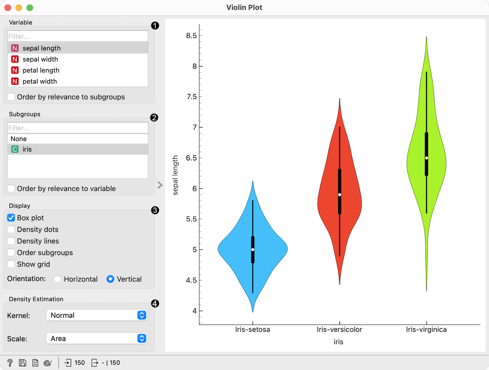
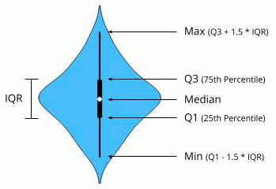
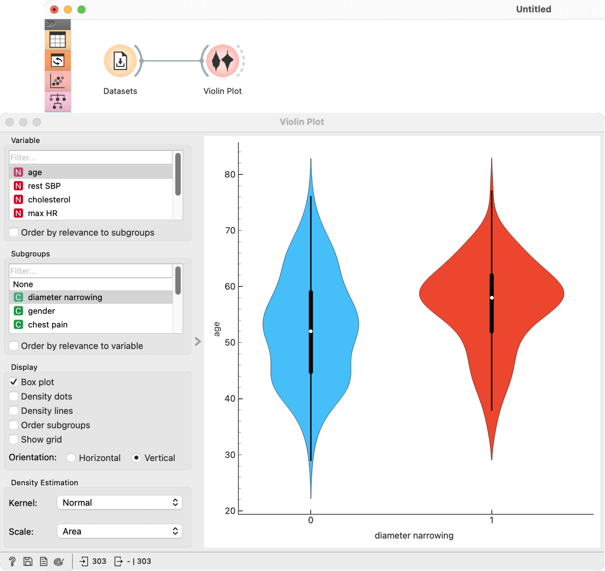

Violin Plot
===========

Visualize the distribution of feature values in a violin plot.

**Inputs**

- Data: input dataset

**Outputs**

- Selected Data: instances selected from the plot
- Data: data with an additional column showing whether a point is selected

The **Violin Plot** widget plays a similar role as a [Box Plot](boxplot.md). It shows the distribution of quantitative data across several levels of a categorical variable such that those distributions can be compared. Unlike the Box Plot, in which all of the plot components correspond to actual data points, the Violin Plot features a kernel density estimation of the underlying distribution.

1. Select the variable you want to plot. Tick *Order by relevance to subgroups* to order variables by Chi2 or ANOVA over the selected subgroup.
2. Choose *Subgroups* to see [violin plots](https://en.wikipedia.org/wiki/Violin_plot) displayed by a discrete subgroup. Tick *Order by relevance to variable* to order subgroups by Chi2 or ANOVA over the selected variable.
3.  *Box plot*: Tick to show the underlying box plot.
    

    *Strip plot*: Tick to show the underlying data represented by points.
    
    *Rug plot*: Tick to show the underlying data represented by lines.
    
    *Order subgroups*: Tick to order violins by *median* (ascending).
    
    *Orientation*: Determine violin orientation.
4.  *Kernel*: Select the kernel used to estimate the density. Possible kernels are: *Normal*, *Epanechnikov* and *Linear*.

    *Scale*: Select the method used to scale the width of each violin. If *area* is selected, each violin will have the same area. If *count* is selected, the width of the violins will be scaled by the number of observations in that bin. If *width* is selected, each violin will have the same width.

Examples
--------

The **Violin Plot** widget is most commonly used immediately after the [File](../data/file.md) widget to observe the statistical properties of a dataset. In the first example, we have used *heart-disease* data to inspect our variables.

The **Violin Plot** could also be used for *outlier detection*. In the next example we eliminate the outliers by selecting only instances that fall inside the [Q1 − 1.5  and Q3 + 1.5 IQR](https://en.wikipedia.org/wiki/Interquartile_range).

