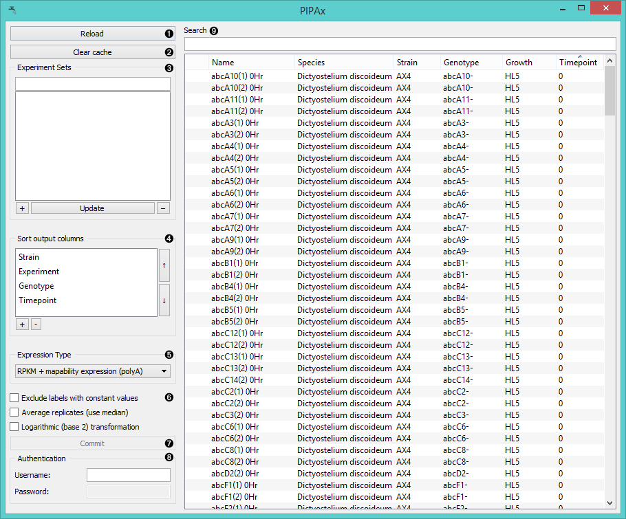
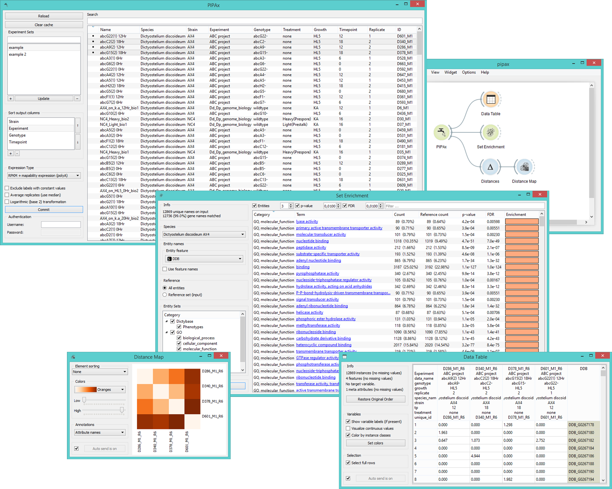

PIPAx
=====

Gives access to PIPA databases.

Signals
-------

**Inputs**:

- (None)

**Outputs**:

- **Data**

  Selected experiments. Each annotated column contains results
  of a single experiment or, if the corresponding option is
  chosen, the average of multiple replicates.

Description
-----------

**PIPAx** is very similar to the **GenExpress** and **GEO Data Sets** widgets as it allows you to upload the data from 
selected experiments.

1. Reloads the experiment data.
2. The widget will automatically save (cache) downloaded data, which makes them available also in the offline mode. To reset    the widget click *Clear cache*.
3. For frequent combinations of experiments use the *Experiment Sets*
   feature: select the experiments and click the "**+**" button to create a new set. You will be asked to name the
   set upon selection. If you wish to add experiments to your set, click on the set name and then select
   additional experiments. Press the *Upload* key to update the set. To select multiple experiments click them while holding 
   the *Control/Command* key. To remove the set click "**-**".
4. In *Sort output columns* set the attributes you wish your data to have. Add attributes with a "+" key and remove them
   with "-". Switch the order of attributes with 'move up' and 'move down' arrows on the right side of the box. By
   double-clicking on the attribute name a dropdown menu will appear from which you can select the desired attribute
   from all that are available.
5. Set the expression type for your output data.
   - **Raw expression** outputs raw experiment data
   - **RPKM expression** outputs data in *reads per kilobase of transcript per million mapped reads*
   - **RPKM expression + mapability expression** outputs data with RKPM and the mapping of the genome
   - **Raw expression (polyA)** outputs raw experiment data with [polyadenylation](https://en.wikipedia.org/wiki/Polyadenylation) tail.
   - **RKPM expression (polyA)** outputs RKPM data with polyA tail.
   - **RKPM expression + mapability expresion (polyA)** outputs all the possible data and is set as default.
6. **Exclude labels with constant values** removes labels that are the same for all selected experiments. 
   **Average replicates (use median)** averages identical experiments by using medians as values. 
   **Logarithmic (base 2) transformation** computes the [binary logarithm](https://en.wikipedia.org/wiki/Binary_logarithm) of     the (value + 1).
7. Selected experiments will appear in the output when the *Commit* button is clicked. You can connec 
   the PIPA widget to any Orange widget which accepts data table as input.
8. If username and passwords are not given, only the public experiments will be accessible. Alternatively you can access 
   the entire ??? data base.
9. **PIPAx** widget lists available experiment data, which can be filtered with the *Search* box at the top.

Example
-------

In the schema below we connected **PIPA** to **Data Table**, **Set Enrichment**, and **Distance Map**
(through **Distances**) widgets.

The **Data Table** widget below contains the output from the **PIPA** widget.
Each column contains gene expressions of a single experiment. The labels
are shown in the table header.

The **Distance Map** widget shows distances between experiments. The
distances are measured with **Distance** widget, which was set to
compute *Euclidean* distances.
