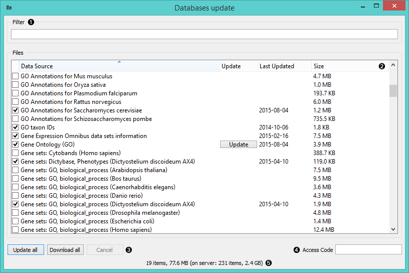
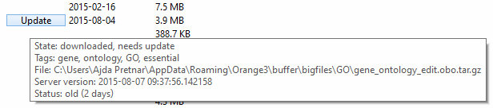

Databases
=========

Updates local systems biology databases, like gene ontologies,
annotations, gene names, protein interaction networks, and similar.

Signals
-------

**Inputs**:

- None

**Outputs**:

- None

Description
-----------

When working with the bioinformatics add-on you can access several databases
directly from Orange. Data sets you have selected in **GEO Data Sets**, **PIPAx**,
**dictyExpress** and **GeneExpress** widgets are cached on your local server or
accessed directly from the web site.

As datasets are not updated automatically, the **Databases Update** widget
allows you to update them with one click. The widget can also be used to
manage your locally stored data sets.

1. Find the desired data set.
2. A list of available data sets by data source, update availability, date of your last update and file size. 
   A large **Update** button will be displayed next to the data sets that need to be updated.
3. **Update All** will update all the selected data sets. **Download All** will download all the selected data sets.
   **Cancel** will abort the action.
4. Some data sets require the *Access code*. Type it in the provided field to access the database.
5. Information on the selected data sets (number of data sets selected, their size + overall number of items on the
   list and their size).

To get a more detailed information on the particular database that
requires an update, hover on its **Update** button.

