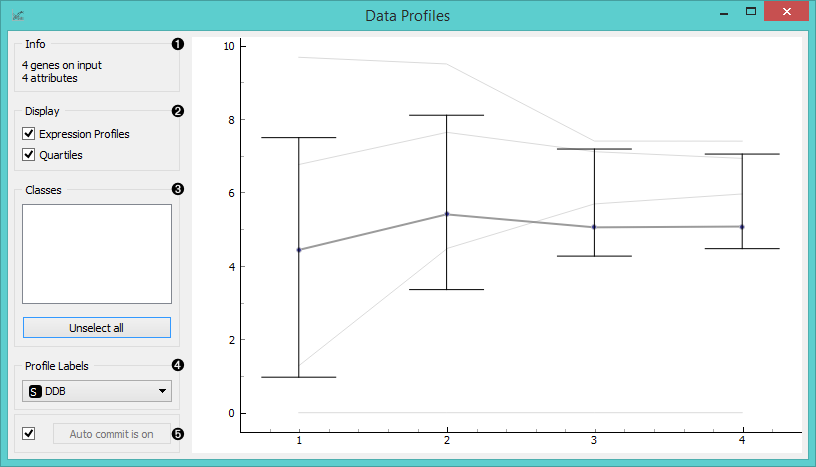
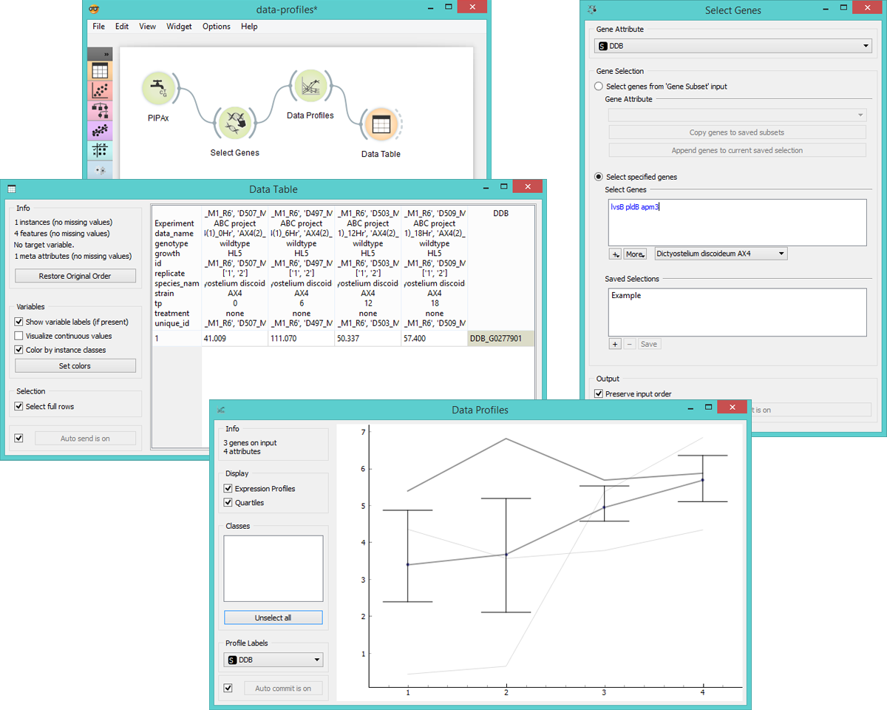

Data Profiles
=============

Plots gene expression levels by attribute in a graph.

Signals
-------

**Inputs**:

- **Data**

  Data set.

**Outputs**:

- **Selected Data**

  Data subset.

Description
-----------

**Data Profiles** plots gene expression levels for each attribute in a graph. The default
graph displays the mean expression level for the input data set. The x-axis represents
attributes and the y-axis gene expression values. By hovering over the line you can see
which gene it represents and by click on the line you will select the gene and output it.

1. Information on the input data.
2. Select display options:
   - **Expression Profiles** will display expression levels for individual data instances.
   - **Quartiles** will show quartile cut-off points.
3. If the data has classes, you can select which class to display by clicking on it. Such data will
   also be colored by class. *Unselect All* will show an empty plot, while *Select All* will diplay
   all data instances by class.
4. Select which attribute you wish to use as a profile label.
5. If *Auto commit is on*, the widget will automatically apply changes to the output. Alternatively click *Commit*.

Example
-------

**Data Profiles** is a great widget for visualizing significant gene expression levels,
especially if the data has been sourced at different timepoints. This allows the user
to see difference in expression levels in time for each instance in the data set and the
over mean.

Below we used the **PIPAx** widget, where we selected 8 AX4 Dictyostelium experiments, all
having been sourced at diffferent timepoints and belonging to one of the two replicates. We
decided to average replicates (to get one instance for both replicates) and to apply logarithmic
transformation to adjust expression levels.

In **Select Genes** we decided to observe only the three genes from the data set that
are a part of the *increased exocytosis* process (lsvB, pldB, amp3), which we selected in
the *Import gene set names* option. This allows us to specify which biological process
we're interested in and to observe only the specified genes.

Then we observe expression levels in **Data Profiles** widget, where we see all three
*Expression Profiles* plotted, together with *Quartiles* and mean expression level. Finally,
we selected the gene with the highest overall expression level and output it to **Data Table**.

