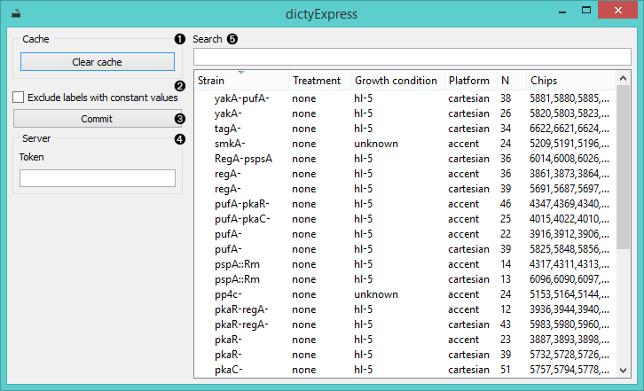
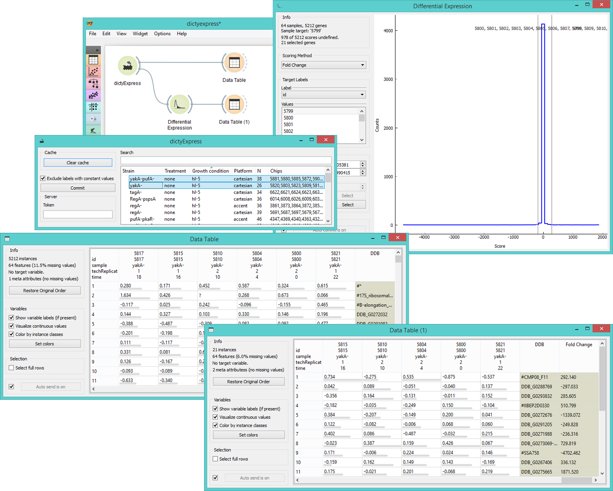

dictyExpress
============

Gives access to [**dictyExpress**](http://dictyexpress.biolab.si/) databases.

Signals
-------

**Inputs**:

- (None)

**Outputs**:

- **Data**

  Selected experiments. Each annotated column contains results
  of a single experiment or, if the corresponding option is
  chosen, the average of multiple replicates.

Description
-----------

**dictyExpress** is a widget for a direct access to [**dictyExpress**](http://dictyexpress.biolab.si/) database 
and it is very similar to the **GenExpress** and **GEO Data Sets** widgets as it allows you to upload the data from 
selected experiments.

1. The widget will automatically save (cache) downloaded data, which makes them available also in the offline mode. To reset    the widget click *Clear cache*.
2. *Exclude labels with constant values* removes labels that are the same for all selected experiments.
3. Selected experiments will appear in the output when the *Commit* button is clicked. You can connect 
   the dictyExpress widget to any Orange widget which accepts data table as input.
4. If token is not given, only public experiments will be accessible. Otherwise you can access 
   the entire dictyExpress data base.
5. **dictyExpress** widget lists available experiment data, which can be filtered with the *Search* box at the top.

Example
-------

In the schema below we connected **ditcyExpress** to a **Data Table** to observe all of
the selected experiments. Then we used **Differential Expression** widget to select
the most relevant genes and output them to another **Data Table**.

