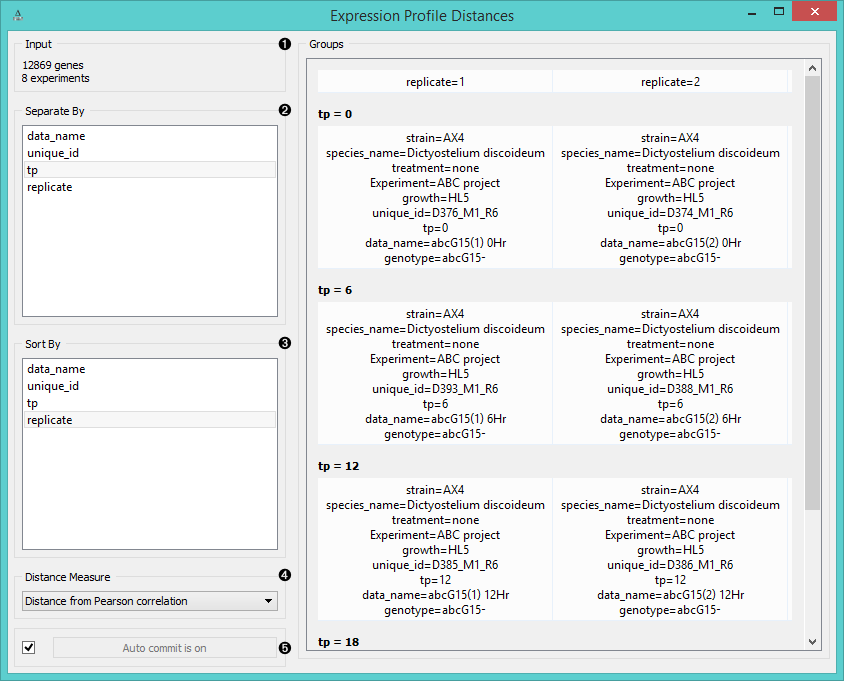
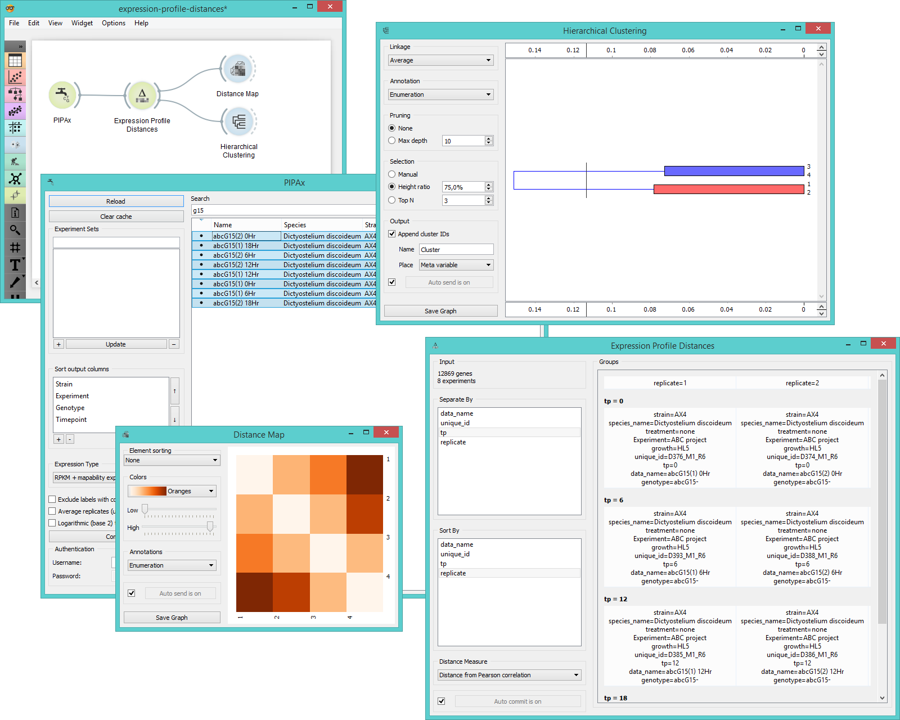

Expression Profile Distances
============================

Computes distances between gene expression levels by groups.

Signals
-------

**Inputs**:

- **Data**

  Data set.

**Outputs**:

- **Distances**

  Distance matrix.
  
- **Sorted Data**

  Data with groups as attributes.

Description
-----------

Widget **Expression Profile Distances** computes distances between expression levels among instance groups.
Groups are data clusters set by the user through *separate by* function in the widget. Data can be separated by one or
more labels (usually timepoint, replicates, IDs, etc.). Widget outputs distance matrix that can be fed into
**Distance Map** and **Hierarchical Clustering** widgets.

1. Information on the input data.
2. Separate the experiments by labels (normally timepoint, replicates, data name, etc.).
3. Sort the experiments by lables.
4. Choose the *Distance Measure*:
    - [**Pearson**](https://en.wikipedia.org/wiki/Pearson_product-moment_correlation_coefficient) (linear correlation between the values, remapped as a distance in a [0, 1] interval)
    - [**Euclidean**](https://en.wikipedia.org/wiki/Euclidean_distance) ("straight line", distance between two points)
    - [**Spearman**](https://en.wikipedia.org/wiki/Spearman's_rank_correlation_coefficient) (linear correlation between the rank of the values, remapped as a distance in a [0, 1] interval)
5. If *Auto commit is on*, the widget will automatically apply changes to the output. Alternatively click *Commit*.

Example
-------

**Expression Profile Distances** widget is used to calculate distances between gene expression values
sorted by labels. We chose 8 experiments measuring gene expression levels on *Dictyostelium discoideum* at
different timepoints. In the **Expression Profile Distances** widget we separated the data by timepoint
and sorted them by replicates. We can see the grouping immediately in the *Groups* box on the right. Then we
fed the results to **Distance Map** and **Hierarchical Clustering** to visualize the distances 
and cluster the attributes.

