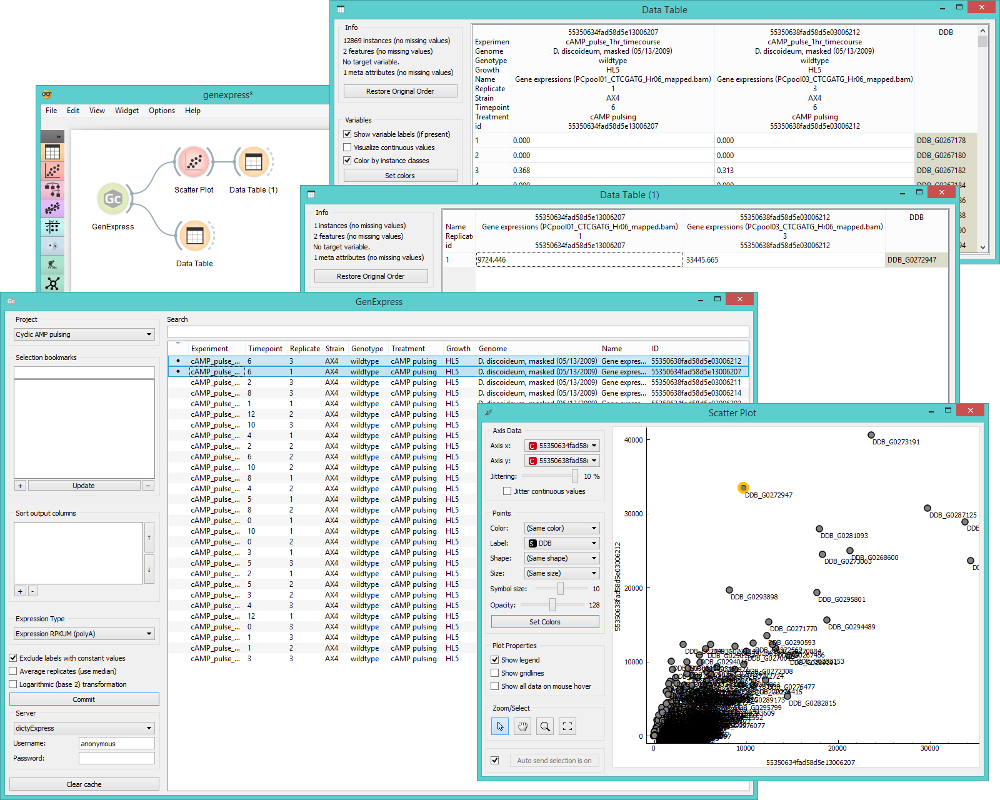

GenExpress
==========

Gives access to [**GenExpress**](https://www.genialis.com/genexpress/) databases.

Signals
-------

**Inputs**:

- (None)

**Outputs**:

- **Data**

  Selected experiments. Each annotated column contains results
  of a single experiment or, if the corresponding option is
  chosen, the average of multiple replicates.

Description
-----------

**GenExpress** is a widget for a direct access to [**GenExpress**](https://www.genialis.com/genexpress/)
database and it is very similar to the **PIPAx** and **GEO Data Sets** widgets as it allows you 
to upload the data from selected experiments.

1. Choose between 7 different projects to source your data from: cyclic AMP pulsing, D. discoideum AX4,
   D. discoideum bacterial growth, D. discoideum prespore/prestalk, D. purpureum AX1 on K.p., D. purpureum
   prespore/prestalk, and filter development.
2. Bookmark your frequent combinations of experiments in *Selection bookmarks*.
   Select the experiments and click the "**+**" button to create a new bookmark. You will be asked to name the
   set upon selection. If you wish to add experiments to your bookmark, click on the bookmark name and then select
   additional experiments. Press the *Update* key to update the set. To select multiple experiments click them while holding 
   the *Control/Command* key. To remove the set click "**-**".
3. In *Sort output columns* set the attributes you wish your data to have. Add attributes with a "+" key and remove them
   with "-". Switch the order of attributes with 'move up' and 'move down' arrows on the right side of the box. By
   double-clicking on the attribute name a dropdown menu will appear from which you can select the desired attribute
   from all that are available.
4. Set the expression type for your output data.
   - **Expression RPKUM (polyA)** outputs data in *reads per kilobase of uniquely mappable transcript per million reads*
   with [polyadenylation](https://en.wikipedia.org/wiki/Polyadenylation) tail.
   - **Expression RPKM** outputs data in *reads per kilobase of transcript per million mapped reads*
   - **Expression RPKM (polyA)** outputs data with RKPM and polyA tail.
   - **Expression RPKUM** outputs only RPKUM data.
   - **Read counts (polyA)** outputs data on read counts with polyA tail.
   - **Read counts (raw)** outputs raw read count data.
5. **Exclude labels with constant values** removes labels that are the same for all selected experiments. 
   **Average replicates (use median)** averages identical experiments by using medians as values. 
   **Logarithmic (base 2) transformation** computes the [binary logarithm](https://en.wikipedia.org/wiki/Binary_logarithm) of     the (value + 1).
6. Selected experiments will appear in the output when the *Commit* button is clicked. You can connect 
   GenExpress widget to any Orange widget which accepts data table as input.
7. Select the server you wish to access the data from (either dictyExpress or Genialis). If username and password are not       given, only public experiments will be accessible.
8. *Clear cache* removes the uploaded data sets from internal memory.
9. **GenExpress** widget lists available experiment data, which can be filtered with the *Search* box at the top.
   To select which attributes to display in the widget right-click on the attribute name.

Example
-------

In the schema below we connected **GenExpress** to **Data Table** to view the gene expression reads
and then to **Scatter Plot**, where we chose to view expression levels from two experiments. In the plot
we select an outlier and view it in another **Data Table**.

