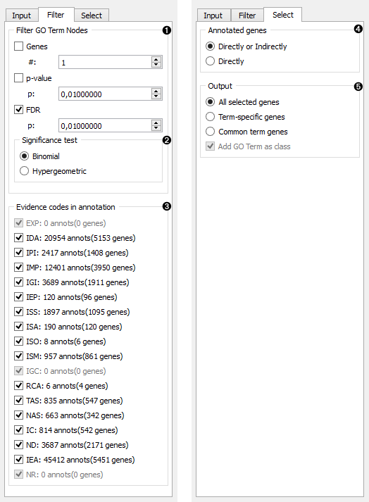

GO Browser
==========

Provides access to Gene Ontology database.

Signals
-------

**Inputs**:

- **Cluster Data**

  Data on clustered genes.

- **Reference Data**

  Data on reference set.

**Outputs**:

- **Data on Selected Genes**

  Data on genes from the selected GO node.

- **Data on Unselected Genes**

  Data on genes from GO nodes that weren't selected.

- **Data on Unknown Genes**

  Data on genes that are not in the GO database.

- **Enrichment Report**

  Data on GO enrichment analysis.

Description
-----------

**GO Browser** widget provides access to [*Gene Ontology database*](http://geneontology.org/). 
Gene Ontology (GO) is a system for hierarchically
classifiying genes and gene products to terms organized in a graph structure called an ontology.
It takes data on gene expression as an input (it is best to input statistically significant genes,
for example for the **Differential Expression** widget) and returns a ranked list of GO terms with
p-values. The user can select a GO term in the list and output the data on the selected or unselected
genes, data on unknown genes and an enrichment report. This is a great tool for finding biological processes
that are over- or under-represented in a particular gene set.

**INPUT** 

1. Information on the input data set. *Ontology/Annotation Info* reports on the current status of updates in GO database.
2. Select organism for the GO term analysis. The widget automatically matches the organism of the input data.
3. Use this attribute to extract gene names for the input data. You can use attribute names as gene names and adjust the naming in the *Gene matcher settings* box. Gene matcher has the following four options:
   - Use gene names from [**Gene Ontology annotations**](http://geneontology.org/page/annotation)
   - Use gene names from [**KEGG Genes database**](http://www.genome.jp/kegg/genes.html)
   - Use gene names from [**NCBI Gene Info database**](http://www.ncbi.nlm.nih.gov/gene)
   - Use [**Affymetric platform reference IDs**](http://www.affymetrix.com/estore/)
4. Select the reference. You can either have the *entire genome* as reference or a *reference set* from the input.
5. Select the ontology where you want to calculate the enrichment. There are three *Aspect* options:
   - [**Biological process**](http://geneontology.org/page/biological-process-ontology-guidelines)
   - [**Cellular component**](http://geneontology.org/page/cellular-component-ontology-guidelines)
   - [**Molecular function**](http://geneontology.org/page/molecular-function-ontology-guidelines)
6. A ranked list of GO terms by aspect:
   - GO term
   - **Cluster**: sample frequency - number of genes in a biological process and their percentage against genes with known annotations.
   - **Reference**: background frequency - number and proportion of genes that are annotated to a particular GO term in the entire genome.
   - **P-value**: probability of seeing at least x number of genes out of n genes annotated to a particular GO term. The closer the p-value is to zero, the more significant the particular GO term is. Value is written in [e notation](https://en.wikipedia.org/wiki/Scientific_notation#E_notation).
   - **FDR**: false discovery rate - a proportion of false discoveries among all discoveries.
   - **Genes**: genes in a biological process.
   - [**Enrichment**](http://geneontology.org/page/go-enrichment-analysis) level

**FILTER** 

1. *Filter GO Term Nodes* by:
   - **Genes**: filter by number of genes mapped to a term
     - # is a minimal number of genes mapped to a term
   - **P-value**: filter by term p-value
     - p is a max term p-value
   - **FDR**: filter by term false discovery rate
     - p is a max term p-value
2. *Significance test* is a test of null hypothesis against a specified distribution:
   - [**Binomial**](https://en.wikipedia.org/wiki/Binomial_distribution): use binomial distribution
   - [**Hypergeometric**](https://en.wikipedia.org/wiki/Hypergeometric_distribution): use hypergeometric distribution
3. **Evidence codes in annotation** show how the annotation to a particular term is supported:
   - EXP: Inferred from Experiment
   - IDA: Inferred from Direct Assay
   - IPI: Inferred from Physical Interaction
   - IMP: Inferred from Mutant Phenotype
   - IGI: Inferred from Genetic Interaction
   - IEP: Inferred from Expression Pattern
   - ISS: Inferred from Sequence Similarity
   - ISA: Inferred from Sequence Alignment
   - ISO: Inferred from Sequence Orthology
   - ISM: Inferred from Sequence Model
   - IGC: Inferred from Genomic Context
   - RCA: Reviewed Computational Analysis
   - TAS: Traceable Author Statement
   - NAS: Non-Traceable Author Statement
   - IC: Inferred by Curator
   - ND: No biological data available
   - IEA: Inferred from Electronic Annotation
   - NR: Not Recorded (Obsolete)

**SELECT** 

4. *Annotated genes* outputs genes that are:
   - **Directly or Indirectly** annotated (direct and inherited annotations)
   - **Directly** annotated (inherited annotations won't be in the output)
5. *Output*:
   - **All selected genes**: outputs genes annotated to all selected GO terms
   - **Term-specific genes**: outputs genes that appear in only one of selected GO terms
   - **Common term genes**: outputs genes common to all selected GO terms
   - **Add GO Term as class**: adds GO terms as class attribute

Example
-------

In the example below we have used **GEO Data Sets** widget, in which we have selected 
*Caffeine effects: time course and dose response* data set, and connected it to a **Differential
Analysis**. Differential analysis allows us to select genes with the highest statistical relevance
(we used ANOVA scoring) and feed them to **GO Browser**. This widget lists four biological
processes for our selected genes. Say we are interested in finding out more about *monosaccharide transport*
as this term has a high enrichment rate. To learn more about which genes
are annotated to this GO term we view it in the **Data Table**, where we see all the genes
participating in this process listed.

