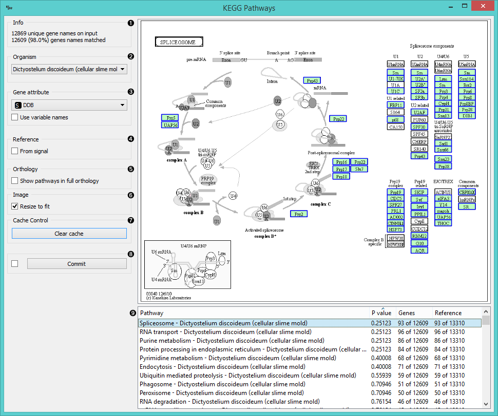

KEGG Pathways
=============

Diagrams of molecular interactions, reactions, and relations.

Signals
-------

**Inputs**:

- **Data**

  Data set.

- **Reference**

  Referential data set.

**Outputs**:

- **Selected Data**

  Data subset.

- **Unselected Data**

  Remaining data.

Description
-----------

**KEGG Pathways** widget displays diagrams of molecular interactions, reactions and relations from the
[KEGG Pathways Database](http://www.genome.jp/kegg/pathway.html). It takes data on gene expression as an
input, matches the genes to the biological processes and displays a list of corresponding pathways. To
explore the pathway, the user can click on any process from the list or arrange them by P-value to get
the most relevant processes at the top.

1. Information on the input and the ratio of matched genes.
2. Select the organism for term analysis. The widget automatically selects the organism from the input data.
3. Set the attribute to use for gene names. If gene names are your attribute names, tick *Use variable names*.
4. If you have a separate reference set in the input, tick *From signal* to use these data as reference.
5. To have pathways listed and displayed by vertical descent, tick *Show pathways in full orthology*.
6. To fit the image to screen, tick *Resize to fit*. Untick the box if you wish to explore the pathways.
7. To clear all locally cached KEGG data, press *Clear cache*.
8. When *Auto commit is on*, the widget will automatically apply the changes. Alternatively press *Commit*.
9. A list of pathways either as processes or in full orthology. Click on the process to display the pathway.
   You can sort the data by P-value to get the most relevant results at the top.

Example
-------
