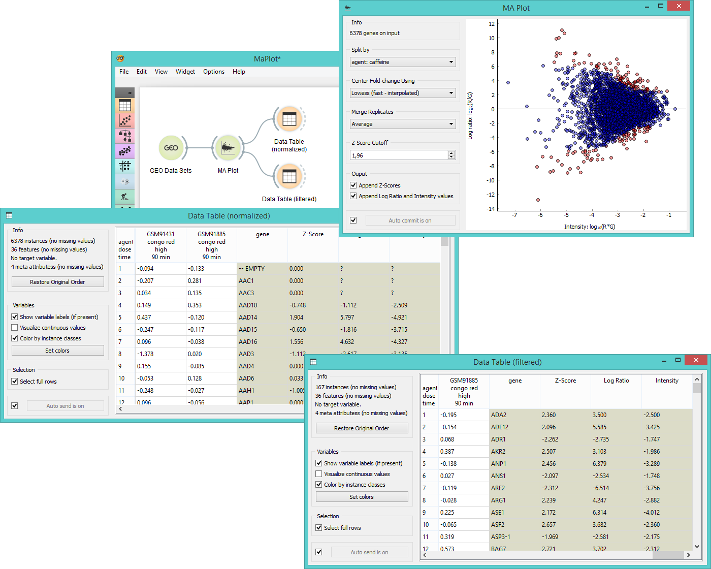

MA Plot
=======

Visualization of intensity-dependent ratio of raw microarray data.

Signals
-------

**Inputs**:

- **Expression Array**

  DNA microarray.

**Outputs**:

- **Normalized Expression Array**

  Lowess-normalized microarray.

- **Filtered Expression Array**

  Selected instances (in the Z-score cutoff).

Description
-----------

[**MA Plot**](https://en.wikipedia.org/wiki/MA_plot) is a graphical method for visualizing intensity-dependent
ratio of raw mircoarray data. The A represents the average log intensity of the gene
expression (x-axis in the plot), while M stands for the binary log of intensity ratio (y-axis). The widget
outputs either normalized data (Lowess normalization method) or instances above the Z-score cutoff line (instances
with meaningful fold changes).

1. Information on the input data.
2. Select the attribute to split the plot by.
3. Center the plot using:
   - **average**
   - [**Lowess (fast-interpolated)**](https://en.wikipedia.org/wiki/Local_regression) normalization method
   - **Lowess** normalization method
4. Merge replicated by:
   - **average**
   - **median**
   - **geometric mean**
5. Set the **Z-score cutoff** threshold. Z-score is your confidence interval and it is set to
   95% by default. If the widget is set to output *filtered expression array*, instances above the
   [Z-score](https://en.wikipedia.org/wiki/Standard_score) threshold will be in the output (red dots in the plot).
6. Ticking the *Append Z-scores* will add an additional meta attribute with Z-scores to your output data. 
   Ticking the *Append Log ratio and Intensity values* will add two additional meta attributes with M and A values
   to your output data.
7. If *Auto commit is on*, the widget will automatically apply changes to the output. Alternatively click *Commit*.

Example
-------

**MA Plot** is a great widget for data visualization and selection. First we select *Caffeine effect: time
course and dose response* data from the **GEO Data Sets** widget and feed it to **MA Plot**. In the plot
we see intensity ratios for a selected experiment variable.

We often need to normalize the experiment data to avoid systematic biases, thus we select *Lowess (fast-interpolated)*
in the *Center Fold-change* box. By ticking both boxes in the *Output* subsection, we get three new meta attributes 
appended - Z-score, Log ratio and Intensity. We see these new attributes and normalized instances in the 
**Data Table** (normalized).

Another possible output for the MA plot widget is *Filtered expression array*, which will give us instances
above the Z-score cutoff threshold (red dots in the plot). We observe these instances the **Data Table** (filtered).

