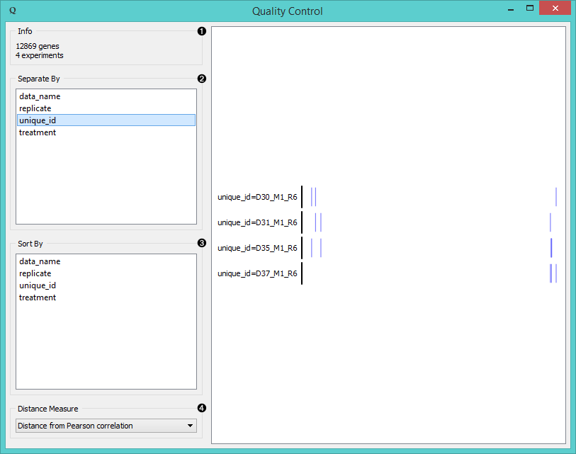
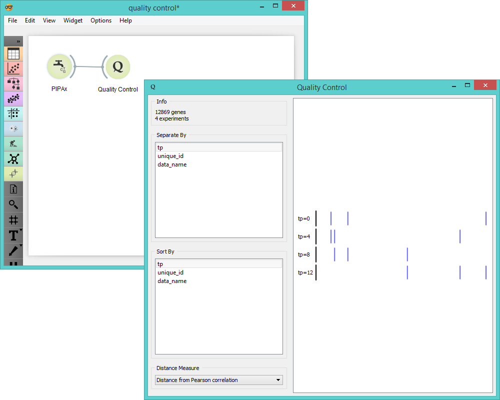

Quality Control
===============

Computes and plots distances between experiments or replicates.

Signals
-------

**Inputs**:

- **Data**

  Data set.

**Outputs**:

- (None)

Description
-----------

**Quality Control** measures distances between experiments and replicates for a selected label. The widget visualizes
distances by selected label. Experiment that lies the farthest from the initial black line is an outlier and
should be additionally inspected for anomalies. In the screenshot below we see that among the four chosen
experiments of NC4 strain of *Dictyostelium discoideum*, the one with ID D37_M1_R6 is the most distant to other experiments
(is an outlier).

1. Information on the input.
2. Separate experiments by label.
3. Sort experiments by label.
4. Compute distances by:
   - [**Pearson correlation**](https://en.wikipedia.org/wiki/Pearson_product-moment_correlation_coefficient)
   - [**Euclidean distances**](https://en.wikipedia.org/wiki/Euclidean_distance)
   - [**Spearman correlation**](https://en.wikipedia.org/wiki/Spearman%27s_rank_correlation_coefficient)

Example
-------

**Quality Control** widget gives us feedback on the quality of our data and can be connected to any widget with
data output. In the example below we fed four experiments of AX4 strain of *Dictyostelium discoideum* from **PIPAx**
widget into **Quality Control** and separated them by timepoint label. In this case experiment performed at
tp 12 is an outlier as it has the greatest distance to other experiments.

