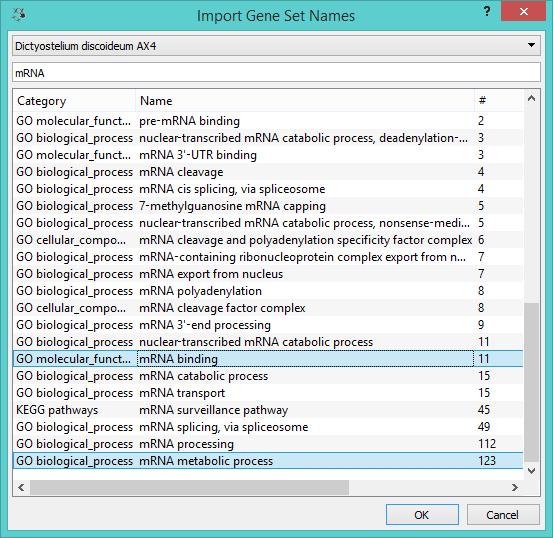

Select Genes
============

Manual selection of gene subset.

Signals
-------

**Inputs**:

- **Data**

  Data set.

- **Gene Subset**

  Data subset.

**Outputs**:

- **Selected Data**

  Data subset.

Description
-----------

**Select Genes** widget is used to manually create the gene subset. The user can decide which genes or gene sets 
will be used. The widget has two input channels: one is the standard *Data* channel that inputs a data sets from on of
the data widgets. The other channel is *Gene subset*, which feeds only a selected subset into the widget
(for example we can use **Differential Expression** widget to select only statistically significant genes). From the
input subset we can sort and select an even smaller subset that will allow for a detailed analysis.

1. Select *Gene Attribute* if there is more than one column with gene names.
2. In *Gene Selection* you can specify how you want to select your genes. *Select Genes from 'Gene
   Subset' input* will work only if a separate subset is provided in the input. Here too you can
   selet *Gene Attribute*. If you wish to create a new saved selection, click *Copy genes to saved
   subsets*. All the genes from the second input will be listed below. If you wish to only add these
   genes to an existing selection, click *Append genes to current saved selection*.
3. With *Select specified genes* you can manually select the genes you wish in your output. Once you start
   typing the gene name, the widget will automatically suggest the possible genes. In the "+" button
   you have a drop-down menu with two options: *Import names from gene sets...* (see below) and *Import
   names from text files...*. In *More* you have two settings: *Complete on gene symbol names* (for easier
   gene selection) and *Translate all names to official symbol names* (for uniformity). Finally, you can set
   also the organism to select the genes from (organism from the input data is chosen as default).
4. *Saved Selections* allow you to save the most frequently used genes. Press "+" to add a new
   selection and "-" to remove the existing one. Once you have selected the genes, press *Save*
   to save the list. By double-clicking the selection in the list above, you can alter its name.
5. *Output* for this widget is a data subset. If you wish to preserve the order of instances from
   your input data, tick the *Preserve input order* box. If *Auto commit is on*, all changes will
   be communicated automatically. Alternatively press *Commit*.

On the other hand we might be interested in specific gene functions. We can go to *Select Specified Genes - 
Select Genes - Import names from gene sets*. Then we get a list of gene sets by category, name and the number
of genes in the set. This is how you can select genes by function - only those input genes that match the selected
function will be in the output (colored blue in the list).

Example
-------

Below is a very simple workflow for this widget. We selected *AX4 Dictyostelium discoideum* data from
different time points and two different replicates from **PIPAx** widget. In **Select Genes**
we used the *Import names from gene sets...* option and selected two mRNA processes that gave us
a list of genes you can see in the *Select Genes* box. Then we fed these data into the **Data Table**.
There are only two genes in the entire *AX4 Dictyostelium discoideum* data that are present in the
selected mRNA processes.

