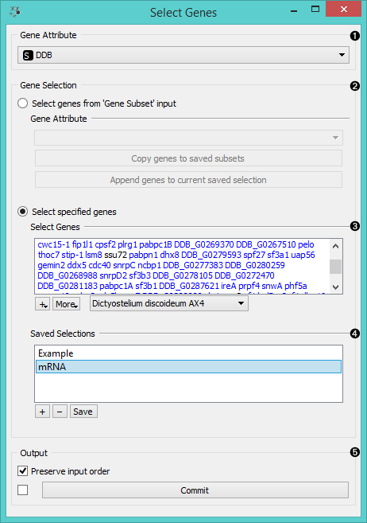
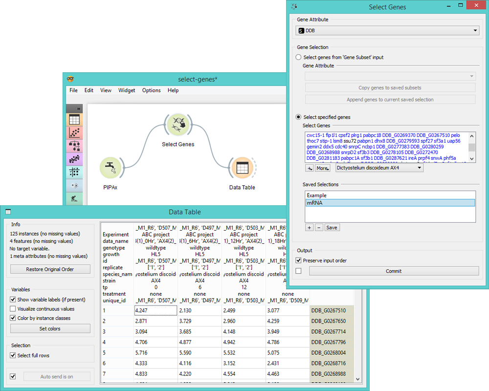

Select Genes
============

Manual selection of gene subset.

Signals
-------

**Inputs**:

- **Data**

  Data set.

- **Gene Subset**

  A subset of genes to be used for gene selection.

**Outputs**:

- **Selected Data**

  A subset of genes selected in the widget.

Description
-----------

**Select Genes** widget is used to manually create the gene subset. There are three ways to select genes:
- Manual gene selection (written input). The widget supports autocompletion for gene names.
- Selecting genes from gene sets in the "+" option.
- Selecting genes from a separate input (input can be adjusted in the widget).

1. Select *Gene Attribute* if there is more than one column with gene names.
2. Specify how you want to select your genes:
   *Select Genes from 'Gene Subset' input* adds genes from the separate input to selected genes.
   To create a new saved selection, click *Copy genes to saved
   subsets*. The genes will be listed in *Select Genes*. To add these
   genes to an existing selection, click *Append genes to current saved selection*.
3. In *Select specified genes* you can type the gene name and the widget will automatically suggest corresponding
   genes. 
4. The "+" button has a drop-down menu with two options:
   - *Import names from gene sets...* gives a list of gene sets and copies genes from selected sets into the list.
   - *Import names from text files...* imports gene names from the file.
   Genes that match the genes in the input will be colored blue, while the unmatched will remain black.
5. *More* has two settings: *Complete on gene symbol names* (for easier
   gene selection) and *Translate all names to official symbol names* (for uniformity).
6. Set the organism to select the genes from (organism from the input data is chosen as default).
7. *Saved Selections* saves the most frequently used genes. "+" adds a new
   selection, "-" removes the existing one, and *Save* saves the current list. Double-click the selection to rename it.
8. *Output* for this widget is a data subset. If you wish to preserve the order of instances from
   your input data, tick the *Preserve input order* box. If *Auto commit is on*, all changes will
   be communicated automatically. Alternatively press *Commit*.

Below is an example of the *Import Gene Set Names* option.

Example
-------

Below is a very simple workflow for this widget. We selected *AX4 Dictyostelium discoideum* data from
different time points and two different replicates from **PIPAx** widget. In **Select Genes**
we used the *Import names from gene sets...* option and selected two mRNA processes that gave us
a list of genes you can see in the *Select Genes* box. Then we fed these data into the **Data Table**.
There are only two genes in the entire *AX4 Dictyostelium discoideum* data that are present in the
selected mRNA processes.

