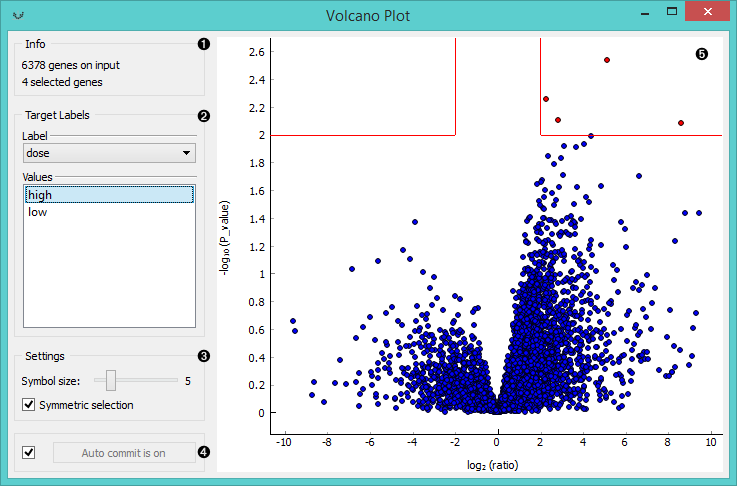
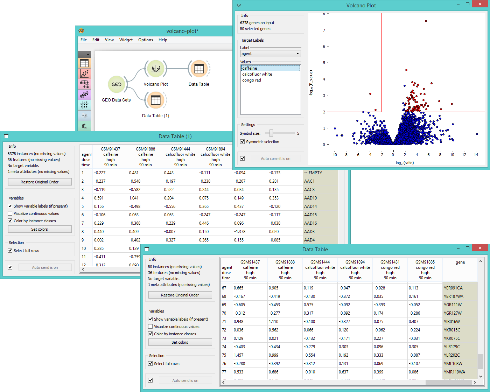

Volcano Plot
============

Plots significance versus fold-change for gene expression rates.

Signals
-------

**Inputs**:

- **Data**

  Input data set.

**Outputs**:

- **Selected data**

  Data subset.

Description
-----------

[**Volcano plot**](https://en.wikipedia.org/wiki/Volcano_plot_(statistics)) is a graphical method for 
visualizing changes in replicate data. The widget plots a binary logarithm of fold-change on the x-axis versus
[statistical significance](https://en.wikipedia.org/wiki/Statistical_significance) 
(negative base 10 logarithm of p-value) on the y-axis. 

**Volcano Plot** is useful for a quick visual identification of statistically significant
data (genes). Genes that are highly dysregulated are
farther to the left and right, while highly significant fold changes appear higher on the plot.
A combination of the two are those genes that are statistically significant - the widget selects 
the top-ranking genes within the top right and left fields by default.

1. Information on the input and output data.
2. Select *Target Labels*. Labels depend on the attributes in the input. In *Values* you can 
   change the sample target (default value is the first value on the list, alphabetically or numerically).
3. Change the *Settings*: adjust the symbol size and turn off symmetrical selection of the output
   data (the widget selects statistically significant instances by default).
4. If *Auto commit is on* the widget will automatically apply the changes. Alternatively click *Commit*.
5. Visualization of the changes in gene expression. The red lines represent the area with the
   most statistically significant instances. Symmetrical selection is chosen by default, but you can
   also manually adjust the area you want in the output.

Example
-------

Below you can see a simple workflow for **Volcano Plot**. We use *Caffeine effect: time course and dose
response* data from **GEO Data Sets** widget and visualize them in a **Data Table**. We have
6378 gene in the input, so it is essential to prune the data and analyse only those genes
that are statistically significant. **Volcano Plot** helps us do exactly that. Once the
desired area is selected in the plot, we output the data and observe them in another **Data Table**.
Now we get only 80 instances, which were those genes that had a high normalized fold change under
high dose of caffeine and had a low p-value at the same time.

