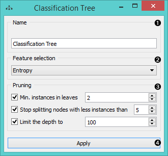
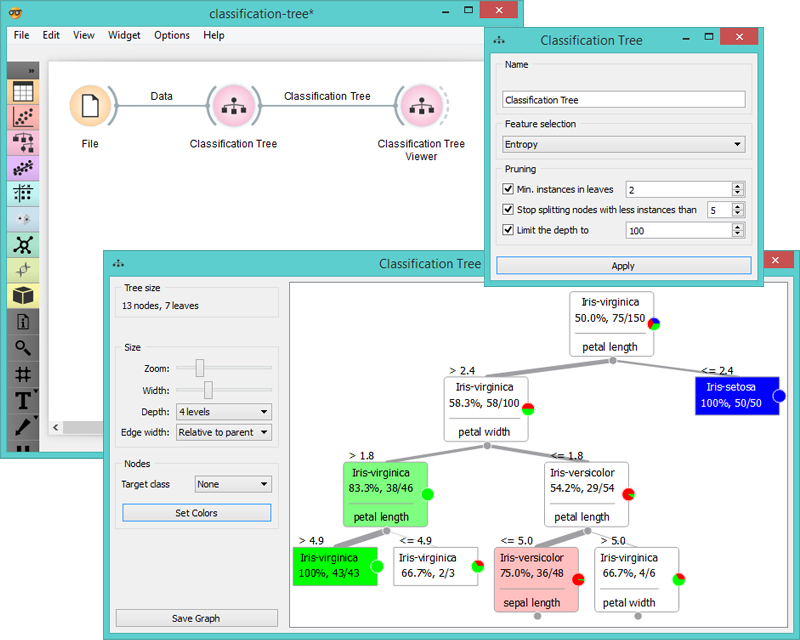
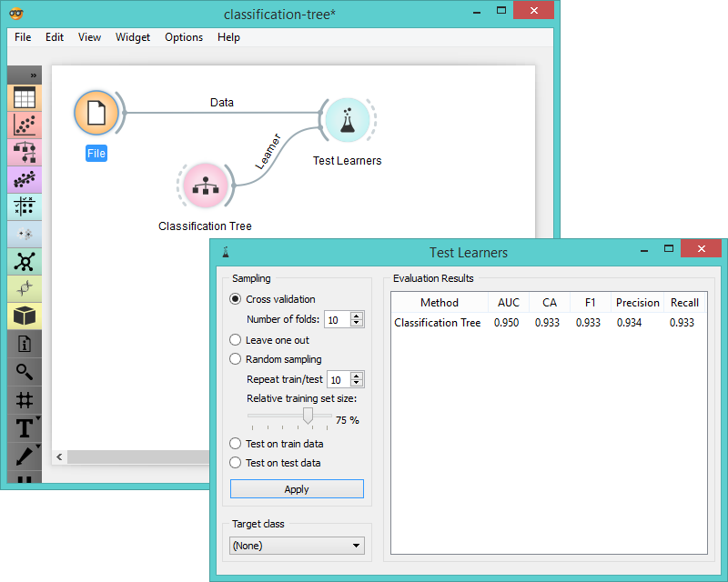

Classification Tree
===================

Classification Tree

Signals
-------

**Inputs**:

- **Data**

  Data set

- **Preprocessor**

  Preprocessed data.

**Outputs**:

- **Learner**

  The classification tree learning algorithm with settings as specified in the dialog.

- **Classification Tree**

  Trained classifier (a subtype of Classifier). Signal *Classification Tree* sends data only if the learning data (signal
  **Classified Data**) is present.

Description
-----------

1. Learner can be given a name under which it will appear in other widgets.
  The default name is “Classification Tree”.

2. In *Feature selection* you can choose a measure for split selection:
    - [**Entropy**](http://www.saedsayad.com/decision_tree.htm) (measure of homogeneity)
    - [**Gini index**](https://en.wikipedia.org/wiki/Gini_coefficient) (measure of dispersion)

3. *Pruning* criteria:
    - **Minimal instances in leaves**; if checked, the algorithm will never construct a
    split which would put less than the specified number of training
    examples into any of the branches.
    - **Stop splitting nodes with less instances than** forbids the algorithm to split
    the nodes with less than the given number of instances.
    - **Limit the depth** of the classification tree.

4. After changing the settings, you need to click *Apply*, which will
put the new learner in the output and, if the training examples are
given, construct a new classifier and output it as well.

Examples
--------

There are two typical uses for this widget. First, you may want to induce
the model and check what it looks like. You do it with the schema below;
to learn more about it, see the documentation on **Classification Tree Viewer**.

The second schema checks the accuracy of the algorithm.

