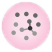
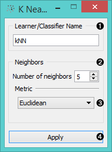
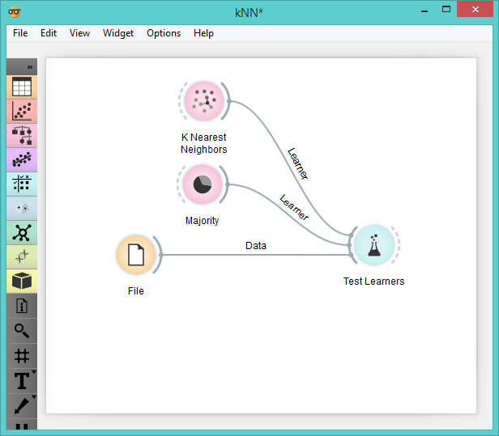

Nearest Neighbors
=================

k-Nearest Neighbors (kNN) learner

Signals
-------

**Inputs**:

- **Data**

  Data set

- **Preprocessor**

  Preprocessed data

**Outputs**:

- **Learner**

  The kNN learning algorithm with settings as specified in the dialog.

- **kNN Classifier**

  Trained classifier (a subtype of Classifier). Signal **kNN Classifier** sends data only if the learning data (signal
  **Data** is present.

Description
-----------

1. A name under that appears in other widgets. The default name is “kNN”.

2. You can set the *Number of neighbors*. Keep in mind though, that all the 
  neighbors are being weighted equally.

3. The *Metrics* you can use are:
    - [*Euclidean*](https://en.wikipedia.org/wiki/Euclidean_distance)
    - [*Manhattan*](https://en.wikipedia.org/wiki/Taxicab_geometry) (the sum of absolute differences for all attributes)
    - [*Maximal*](https://en.wikipedia.org/wiki/Chebyshev_distance) (the maximal difference between attributes)
    - [*Mahalanobis*](https://en.wikipedia.org/wiki/Mahalanobis_distance) (difference between an attribute and the mean).

4. When you change one or more settings, you need to push *Apply*, which will
  put the new learner in the output and, if the training examples are
  given, construct a new classifier and output it as well.

Example
-------

This schema compares the results of [k-Nearest neighbors](https://en.wikipedia.org/wiki/K-nearest_neighbors_algorithm) with the
default classifier which always predicts the majority class.

