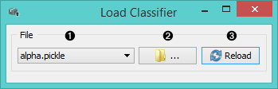
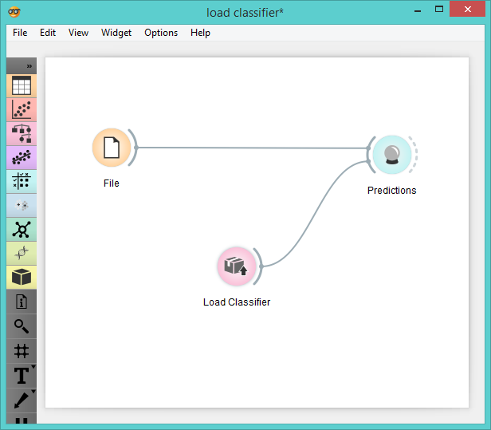

Load Classifier
===============

Loads existing classifier

Signals
-------

**Inputs**:

- None

**Outputs**:

- **Classifier**

  Classifier with selected parameters.

Description
-----------

1. Choose the name of the file.

2. Browse for saved classifiers.

3. Reload selected classifier.

Example
-------

When you want to use a custom-set classifier that you've saved before,
open the **Load Classifier** widget and select the desired file
with the *Browse* icon. This widget loads the exisiting classifier into 
**Predictions** widget for predicting classes.

