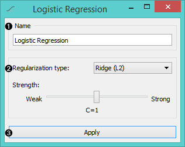
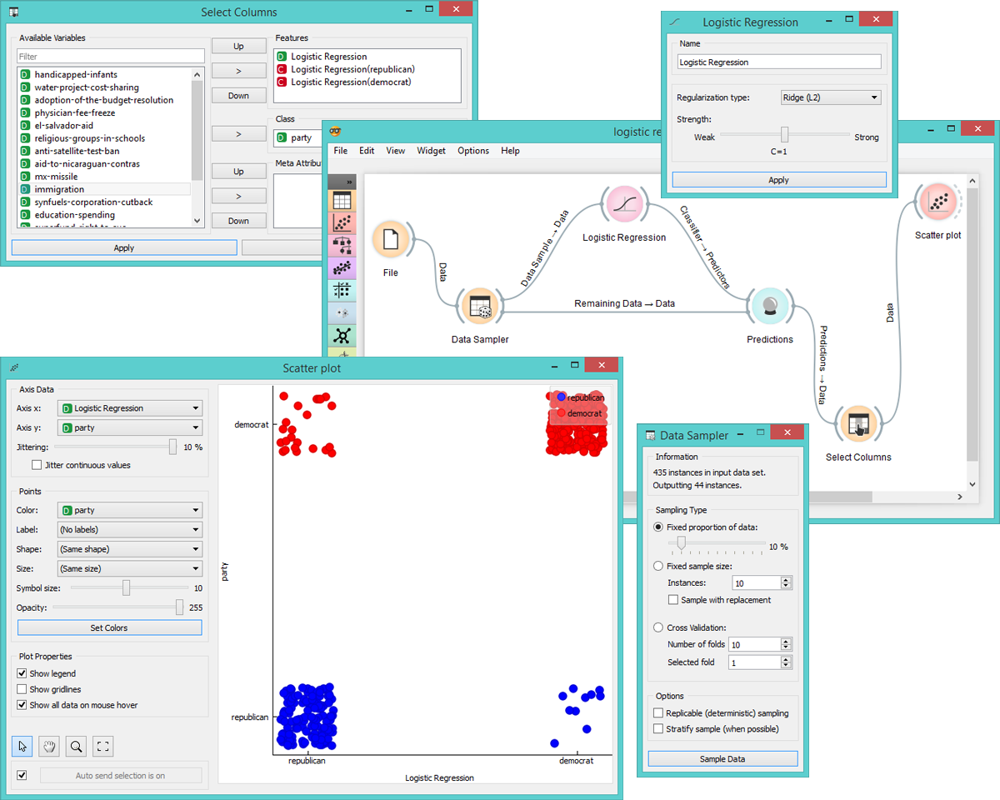

Logistic Regression
===================

Logistic Regression Learner

Signals
-------

**Inputs**:

- **Data**

  Data set
- **Preprocessor**

  Preprocessed data

**Outputs**:

- **Learner**

  The logistic regression learning algorithm with settings as specified in the dialog.

- **Logistic Regression Classifier**

  Trained classifier (a subtype of Classifier). **Logistic Regression Classifier** sends data only if the data input is present.

Description
-----------

1. A name under which the learner appears in other widgets. The default name is "Logistic Regression".
2. [Regularization](https://en.wikipedia.org/wiki/Regularization_(mathematics)) type (either [L1](https://en.wikipedia.org/wiki/Least_squares#Lasso_method) or [L2](https://en.wikipedia.org/wiki/Tikhonov_regularization)). Set the cost strength (default is C=1).
3. Press '*Apply*' to commit changes.

Example
-------

The widget is used just as any other widget for inducing a classifier. This is an example demonstrating the prediction value of logistic regression used on *voting.tab* data set. We first use a **Logistic Regression** learner to provide a LR classifier for **Predictions** widget. We want to see the quality of LR prediction model a person being a republic or a democrat based on their voting patterns. In **Select Attributes** we choose logistic regression as a feature and party as a class. Then we use **Scatterplot** to see which instances were correctly predicted and which were false.

