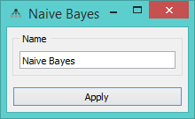
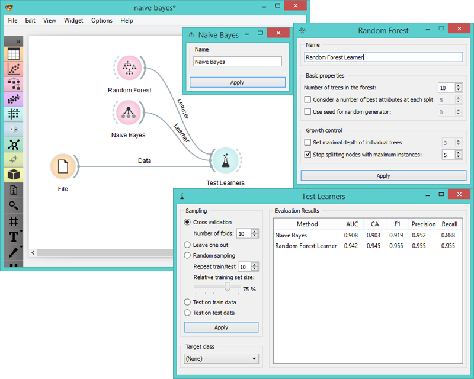
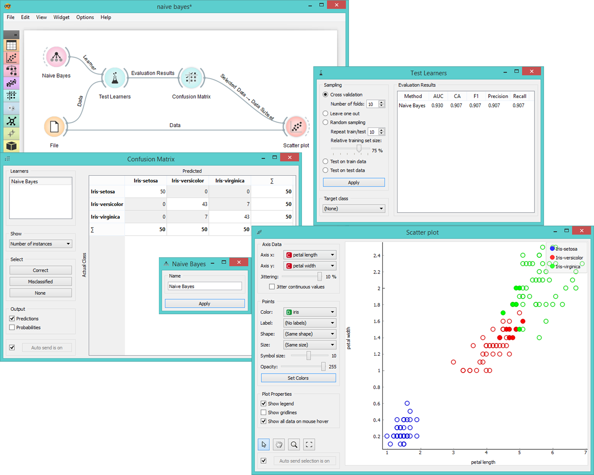

Naive Bayes
===========

Naive Bayesian Learner

Signals
-------

**Inputs**:

- **Data**

  Data set

- **Preprocessor**

  Preprocessed data

**Outputs**:

- **Learner**

  Naive Bayesian learning algorithm with settings as specified in the dialog. It can be fed into widgets for testing learners.

- **Naive Bayesian Classifier**

  Trained classifier (a subtype of Classifier). The *Naive Bayesian Classifier* signal sends data only if the learning data
(signal **Data**) is present.

Description
-----------

The only option in this widget is the name under which it will appear in other widgets. The default name is '*Naive Bayes*'.
When you change it, you need to press '*Apply*'.

Examples
--------

Here we present two uses of this widget. First we compare the results of **Naive Bayesian learner** with another
learner, a **Random Forest**.

The second schema show the quality of predictions made with **Naive Bayes**. We feed the **Test Learners** widget
a Naive Bayes learner and then send the data to the **Confusion Matrix**. In this widget we select misclassified
instances and show them in **Scatterplot**. The bold dots in the scatterplot are the misclassified instances
from **Naive Bayes**.

