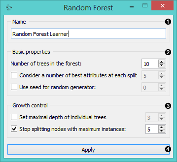
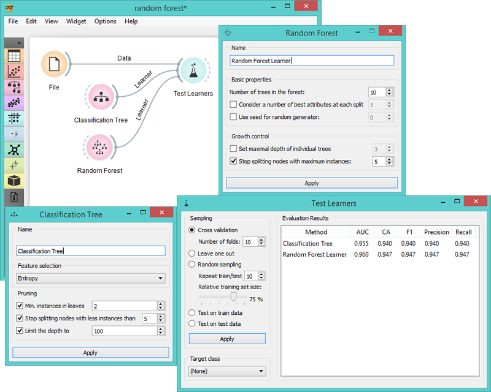

Random Forest
=============

Random forest learner

Signals
-------

**Inputs**:

- **Data**

  Data set
  
- **Preprocessor**

  Preprocessed data.

**Outputs**:

- **Learner**

  Random forest learning algorithm with settings as specified in the dialog.

- **Random Forest Classifier**

  Trained classifier.

Description
-----------

[Random forest](https://en.wikipedia.org/wiki/Random_forest) is a classification technique proposed by
(Breiman, 2001). When given a set of class-labeled data, **Random Forest** builds a set of
classification trees. Each tree is developed from a bootstrap sample
from the training data. When developing individual trees, an arbitrary
subset of attributes is drawn (hence the term “random”) from which the
best attribute for the split is selected. Classification is based on
the majority vote from individually developed tree classifiers in the
forest.

1. Specify the name of the learner or classifier. The default name is "*Random Forest Learner*".

2. Specify how many classification trees will be included in the forest
(*Number of trees in the forest*), and how many attributes will be arbitrarily
drawn for consideration at each node. If the latter is not specified
(option *Consider a number...* left unchecked), this number is equal to
the square root of the number of attributes in the data.

3. Original Brieman’s proposal is to grow the trees without any pre-prunning, but since pre-pruning
often works quite well and is faster, the user can set the depth to which the
trees will be grown (*Set maximal depth of individual trees*). Another
pre-pruning option is to *stop splitting nodes* when the maximal depth is reached.

4. Click *Apply* to communicate the changes to other widgets.

Example
-------

Example below shows a comparison schema of a random forest and
a tree learner on a specific data set.

References
----------

Breiman, L. (2001). Random Forests. In Machine Learning, 45(1), 5-32. Available [here](http://download.springer.com/static/pdf/639/art%253A10.1023%252FA%253A1010933404324.pdf?originUrl=http%3A%2F%2Flink.springer.com%2Farticle%2F10.1023%2FA%3A1010933404324&token2=exp=1434636672~acl=%2Fstatic%2Fpdf%2F639%2Fart%25253A10.1023%25252FA%25253A1010933404324.pdf%3ForiginUrl%3Dhttp%253A%252F%252Flink.springer.com%252Farticle%252F10.1023%252FA%253A1010933404324*~hmac=93fc12faf46899d3cca65e325a946afa897da2a05495736982e04585f9ee6ff3)
