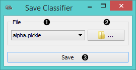
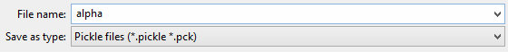
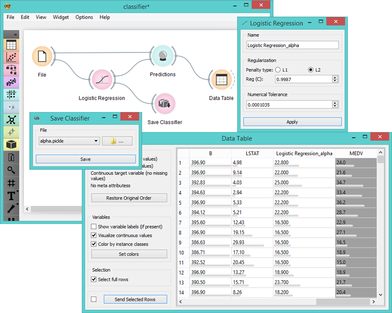

Save Classifier
===============

Saves classifier

Signals
-------

**Inputs**:

- **Classifier**

  Classifier with selected parameters.

**Outputs**:

- None

Description
-----------

1. Choose file name.

2. Save the classifier with *Browse* icon. Click on the icon and enter the name of the file.
  Classifier will be saved as type *.pickle*.

  

3. Save the classifier.

Example
-------

When you want to save a custom-set classifier, select the desired parameters in the classification widget
and connect it to **Save Classifier**.
Name the classifier; load it later into workflows with data sets containing compatible attributes.

