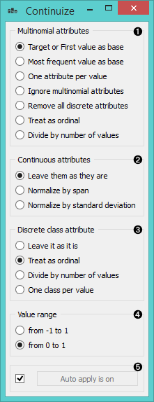
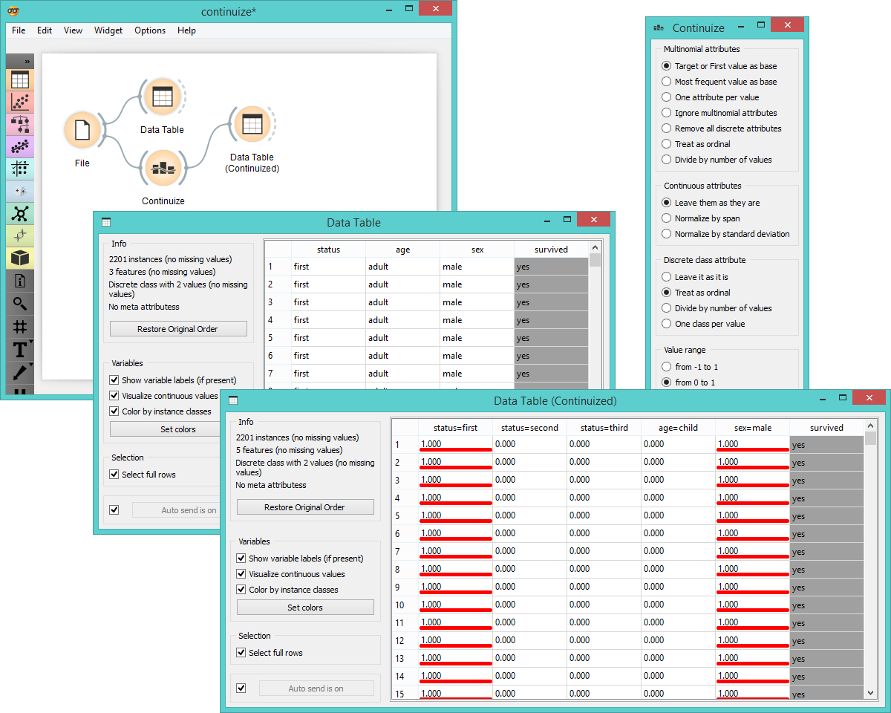
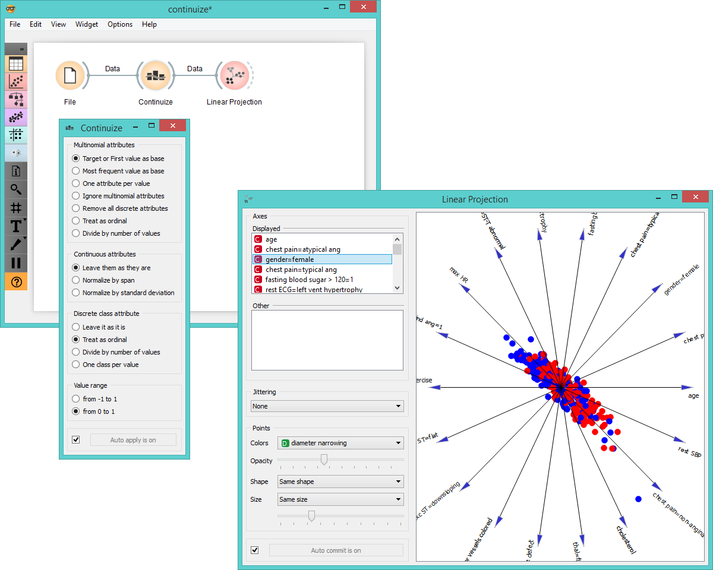

Continuize
==========

Turns discrete attributes into continuous dummy variables.

Signals
-------

**Inputs**:

- **Data**

  Input data set.

**Outputs**:

- **Data**

  Output data set.

Description
-----------

**Continuize** widget receives a data set in the input and outputs the same
data in which the discrete attributes (including binary attributes) are
replaced with continuous.

1. [*Continuization methods*](https://en.wikipedia.org/wiki/Continuity_correction), which define the treatment of
multivalued discrete attributes. Say that we have a discrete attribute
status with values low, middle and high, listed in that order. Options
for their transformation are:

  - **Target or First value as base**: the attribute will be transformed
  into two continuous attributes, status=middle with values 0 or 1
  signifying whether the original attribute had value middle on a
  particular example, and similarly, status=high. Hence, a
  three-valued attribute is transformed into two continuous
  attributes, corresponding to all except the first value of
  the attribute.
  - **Most frequent value as base**: similar to the above, except that the
  data is analyzed and the most frequent value is used as a base.
  So, if most examples have the value middle, the two newly
  constructed continuous attributes will be status=low
  and status=high.
  - **One attribute per value**: this would construct three continuous
  attributes out of a three-valued discrete one.
  - **Ignore multinominal attributes**: removes the multinominal
  attributes from the data.
  - **Treat as ordinal**: converts the attribute into a continuous
  attribute with values 0, 1, and 2.
  - **Divide by number of values**: same as above, except that the values
  are normalized into range 0-1. So, our case would give values 0, 0.5 and 1.

2. Define the treatment of continuous attributes. You will usually prefer *Leave as it is* option. The alternative is 
  *Normalize by span* which will subtract the lowest value found in the data and divide by the
  span, so all values will fit into \[0, 1\]. Finally, *Normalize by variance* subtracts the average and divides by the 
  variance.

3. Define the treatment of class attributes. Besides leaving it as it is, 
  there are also a couple of options which are
  available for multinominal attributes, except for those options which
  split the attribute into more than one attribute - this obviously cannot
  be supported since you cannot have more than one class attribute.

4. With *value range*, you can define the values of the new attributes. In
  the above text we supposed the range *from 0 to 1*. You can change it to
  *from -1 to 1*.

5. If *Auto apply is on*, the data set is committed on any change.
  Otherwise, you have to press *Apply* after each change.

Examples
--------

First let's what is the output of **Continuize** widget. We feed the original data into the
**Data Table** and see how they look like. Then we continuize the discrete values and
observe them in another **Data Table**.

In the second example we show a typical use of this widget: in order to
properly plot linear projection of the data, discrete attributes need to
be converted to continuous, therefore we put the data through **Continuize**
widget before drawing it. Attribute "*chest pain*" originally had four
values and was transformed into three continuous attributes; similar
happened to gender, which was transformed into a single attribute
"*gender=female*".

