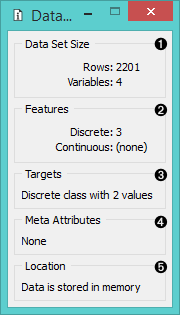
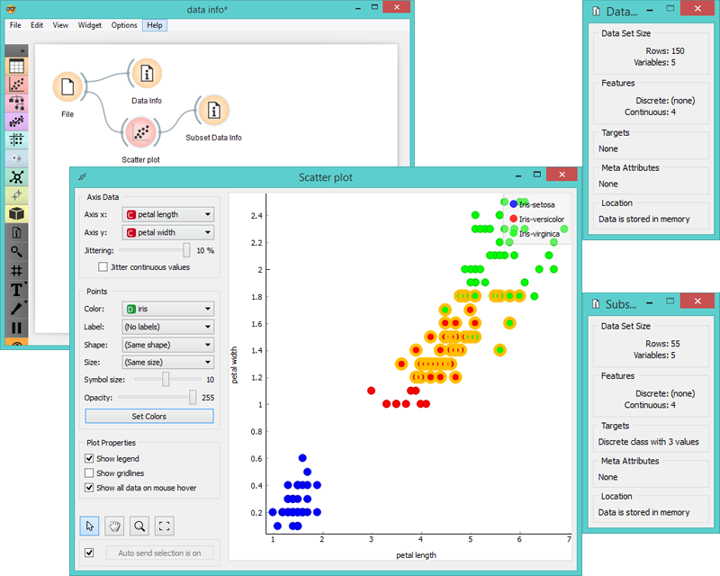

Data Info
=========

Displays information on the selected data set.

Signals
-------

**Inputs**:

- **Data**

  A data set.

- **Selected Data**

  A data subset.

**Outputs**:

- (None)

Description
-----------

A simple widget that presents information on data set size, features, targets, meta attributes, and location. It is useful when you manually select a subset and you want to see information on the selected subset.

1. Information on data set size
2. Information on discrete and continuous features
3. Information on targets
4. Information on meta attributes
5. Information on where the data is stored

Examples
--------

Below we compare two **Data Info** widgets - one with the information on the entire data set and the other with the information on the (manually) selected subset from the **Scatterplot** widget.

