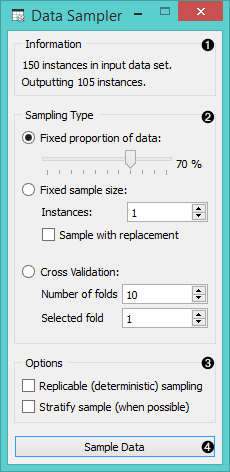
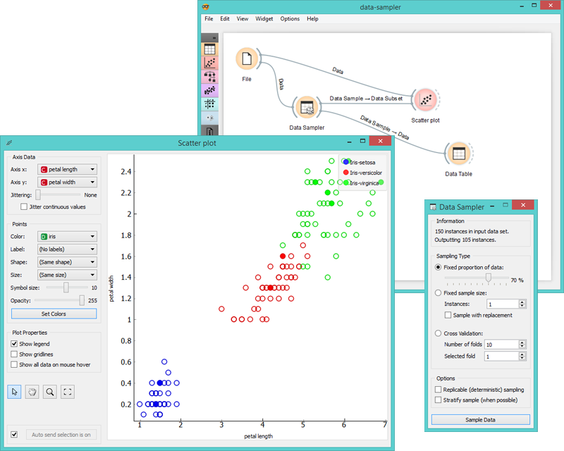

Data Sampler
============

Selects a subset of data instances from the input data set.

Signals
-------

**Inputs**:

- **Data**

  Input data set to be sampled.

**Outputs**:

- **Data Sample**

  A set of sampled data instances.

- **Remaining Data**

  All other data instances from input data set that are not included in the sample.

Description
-----------

**Data Sampler** implements several means of sampling of the data from the
input channel. It outputs the sampled data set and complementary data
set (with instances from the input set that are not included in the
sampled data set). Output is processed after the input data set is provided and *Sample Data* is pressed.

1. Information on the input and output data set.
2. The desired sampling method.
3. Replicable sampling maintains sampling patterns that can be carried across users, while stratification mimics the composition of the input data set.
4. Press '*Sample data*' to output the data sample.

Example
-------

In the following workflow schema we have sampled 10 data instances
from the *Iris* data set and sent the original data and the sample to **Scatterplot**
widget. Sampled data instances are plotted with filled circles.

