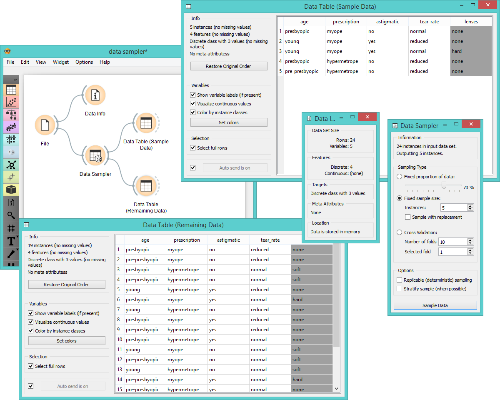

Data Sampler
============

Selects a subset of data instances from the input data set.

Signals
-------

**Inputs**:

- **Data**

  Input data set to be sampled.

**Outputs**:

- **Data Sample**

  A set of sampled data instances.

- **Remaining Data**

  All other data instances from input data set that are not included in the sample.

Description
-----------

**Data Sampler** implements several means of sampling of the data from the
input channel. It outputs the sampled data set and complementary data
set (with instances from the input set that are not included in the
sampled data set). Output is processed after the input data set is provided and *Sample Data* is pressed.

1. Information on the input and output data set.
2. The desired sampling method:
    - *Fixed proportion of data* returns a selected percentage of the entire data (e.g. 70% of all the data)
    - *Fixed sample size* return a selected number of data instances with a chance to set *Sample with replacement* which always sample from the entire data set (does not subtract instances already in the subset)
    - [*Cross Validation*](https://en.wikipedia.org/wiki/Cross-validation_(statistics)) partitions data instances into complimentary subsets where you can select the number of folds (subsets) and which fold you want to use as a sample
3. *Replicable sampling* maintains sampling patterns that can be carried across users, while *stratification* mimics the composition of the input data set.
4. Press '*Sample data*' to output the data sample.

Examples
--------

First let's see how the **Data Sampler** works. Let's look at the information on the original data set in the 
**Data Info** widget. We see there are 24 instances in the data (we used *lenses.tab*). We sampled the data with 
**Data Sampler**, where we choose to go with a fixed sample size of 5 instances for simplicity. 
We can observe the sampled data in the **Data Table** widget. The second
**Data Table** shows the remaining 19 instances that weren't in the sample.

In the workflow below we have sampled 10 data instances
from the *Iris* data set and sent the original data and the sample to **Scatterplot**
widget for exploratory data analysis. Sampled data instances are plotted with filled circles,
while the original data set is represented with the empty circles.

