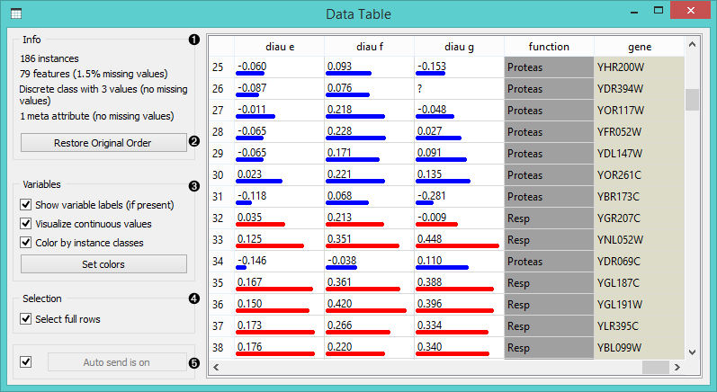
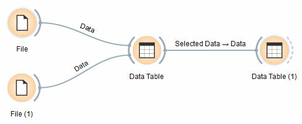
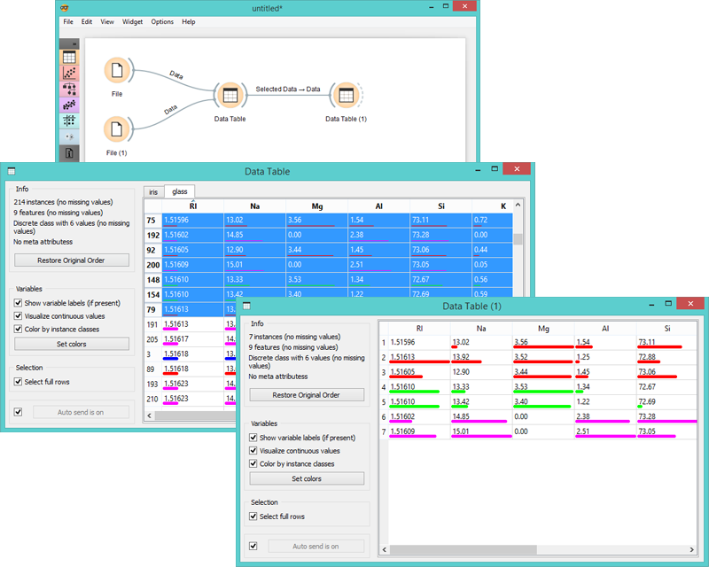

Data Table
==========

Displays attribute-value data in a spreadsheet.

Signals
-------

**Inputs**:

- **Data**
 
  Attribute-valued data set.

**Outputs**:

- **Selected Data**

  Selected data instances.

Description
-----------

**Data Table** widget receives one or more data sets in its input and
presents them as a spreadsheet. Data instances may be sorted by
attribute values. Widget also supports manual selection of data
instances.

1.  The name of the data set (usually the input
    data file). Data instances are in rows and their
    attribute values in columns. In this example the data set is
    sorted by the attribute "sepal length".
2.  Use '*Restore Order*' button to
    reorder data instance after attribute-based sorting.
3.  Info on current data set size and the number and types of
    attributes.
4.  Values of continuous attributes can be visualized with bars; colors can be attributed to different classes.
5.  Data instances (rows) can be selected and sent to the widget's
    output channel.
6.  While auto-send is on, all changed will be automatically communicated to other widgets. Otherwise press '*Send Selected      Rows*'.

Example
-------

We used two **File** widgets to read the *iris* and *glass* data set (provided in
Orange distribution), and send them to the **Data Table** widget.

Selected data instances in the first **Data Table** are passed to the second
**Data Table**. Notice that we can select which data set to view (iris or
glass). Changing from one data set to another alters the communicated
selection of the data instances if "*Commit on any change*" is selected.

