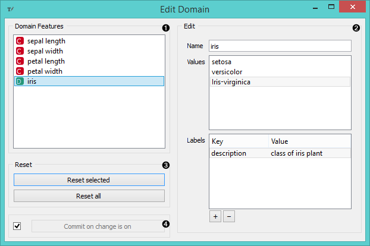

Edit Domain
===========

Signals
-------

**Inputs**:

- **Data (Orange.data.Table)**

  Input data set

**Outputs**:

- **Data (Orange.data.Table)**

  Edited output data set

Description
-----------

This widget can be used to edit/change the domain of the data set.

1. All features (including meta attributes) from the input data set
are listed in the *Domain Features* list in the box on the left. Selecting one
feature displays an editor on the right.

2. The name of the feature can be changed in the *Name* line edit.

  For *Discrete* features value names can also be changed in the
*Values* list box.

  Additonal feature annotations can be added/removed/edited in the *Labels*
box. To add a new label click the "+" button and add the *Key* and *Value*
columns for the new entry. Selecting an existing label and pressing "-"
will remove the annotation.

3. To revert the changes made to the feature press *Reset Selected* button in
the *Reset* box while the feature is selected in the *Domain Features* list.
Pressing *Reset All* will reset all features in the domain at the same
time.

4. Pressing *Commit* button will send the changed domain data set to the
output channel.
