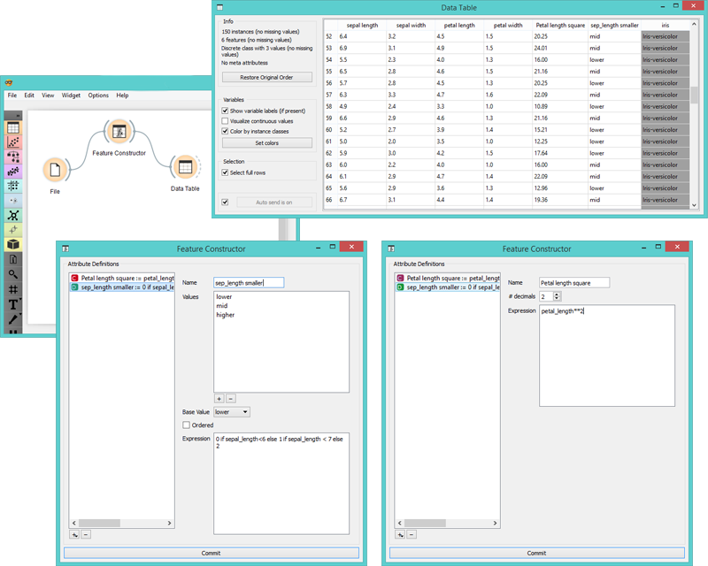

Feature Constructor
===================

Add new features to your data set.

Signals
-------

**Inputs**:

- **Data**

  A data set.

**Outputs**:

- **Data**

  Modified data set.

Description
-----------

**Feature Constructor** allows you to manually add features (columns) into your data set. The new feature can be a computation of the existing one or a combination of several (addition, subtraction, etc.). You can choose what type of feature it will be (discrete, continuous or string) and what its parameters are (name, value, expression). For continuous variables you must define decimal precision and construct an expression in a Python mode. 

1. List of constructed attributes
2. Add or remove features
3. New feature name
4. Decimal precision
5. Expression in Python
6. Press commit to communicate changes

For discrete variables, however, there's a bit more work. First add or remove the values you want to for the new feature. Then select the base value and the expression. In the example below, we have constructed an expression with 'if lower than' and defined three conditions; the program ascribes 0 (which we renamed to lower) if the original value is lower than 6, 1 (mid) if it is lower than 7 and 2 (higher) for all the other values. 

1. New feature name
2. List of discrete values (click on the value to rename it)
3. Add or remove discrete values
4. Select base value
5. Order the values
6. Expression in Python

Examples
--------

With **Feature Constructor** you can easily adjust or combine existing features into new ones. Below we have added one new continuous and one new discrete feature. Notice that we use an underscore for the feature name (e.g. petal_length). For the continuous feature we squared the existing *petal length* value, while we used *lower than* for the discrete one.

Hints
-----

If you are unfamiliar with Python math language, here's a quick introduction.
- +, - to add, subtract
- * to multiply, / to divide
- % to divide and return the remainder
- ** exponent (for square root square by 0.5)
- // for floor division
- <, >, <=, >= less than, greater than, less or equal, greater or equal
- == for equal
- != for not equal

As in example:
(*value*) if (*feature name*) < (*value*), else (*value*) if (*feature name*) < (*value*), else (*value*)

[Use value 1 if feature is less than specified value, else use value 2 if feature is less than specified value 2, else use value 3.]

See more [here](http://www.tutorialspoint.com/python/python_basic_operators.htm).
