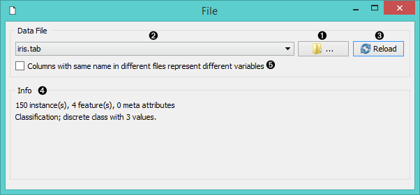

File
====

Reads attribute-value data from an input file.

Signals
-------

**Inputs**:

 - (None)

**Outputs**:

 - **Data**

  Attribute-valued data from the input file.

Description
-----------

**File** widget reads the input data file (data table with data instances)
and sends the data set to its output channel. History of the most recently opened files is maintained in the widget. The widget also includes a directory with sample data sets that come pre-installed with Orange.

The widget reads data from Excel (**.xlsx**), simple tab-delimited (**.txt**) or comma-separated
files (**.csv**).

1. Browse for a data file.
2. Browse through previously opened data files, or load any of the sample ones.
3. Reloads currently selected data file.
4. Information on the loaded data set: data set size, number and types of data features.
5. Allows you to distinguish between columns with the same name across files (otherwise columns with the same name will be considered as the same attribute).

Example
-------

Most Orange workflows would probably start with the **File** widget. In the
schema below, the widget is used to read the data that is sent to both the
**Data Table** and the **Box Plot** widget.

