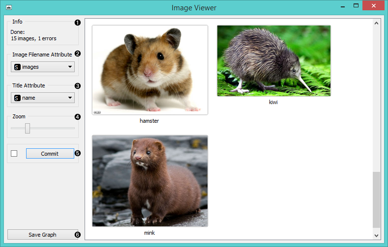
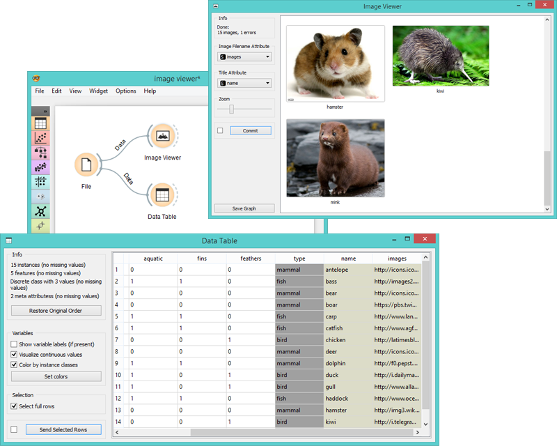
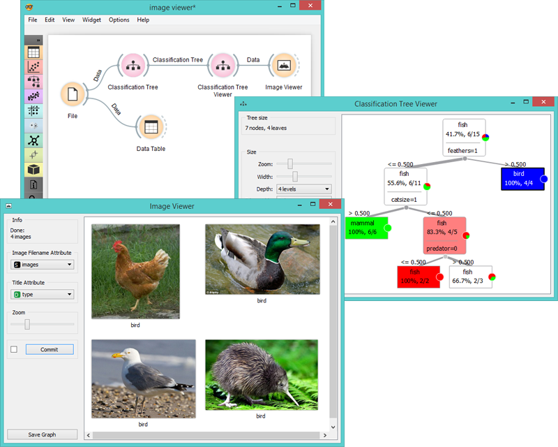

Image Viewer
============

Displayes images that come with the data set.

Signals
-------

**Inputs**:

- **Data**

  Data set with images.

**Outputs**:

- **Data**

  Images that come with the data.

Description
-----------

**Image Viewer** widget can display images from the data set that are stored locally or on the internet. It can be used for image comparison, where we look for similarities or discrepancies between selected data instances (e.g. bacterial growth or bitmap representations of handwriting).

1. Information on the data set.
2. Select the column with image data (links).
3. Select the column with image titles.
4. Zoom in or out.
5. Tick the box on the left to commit changes automatically. Alternatively, click "*Commit*".
6. Saves the visualization in a file.

Examples
--------

A very simple way to use this widget is to connect **File** widget with **Image Viewer** and see all the images that come with your data set.

Alternatively you can visualize only selected instances as in the example below.

