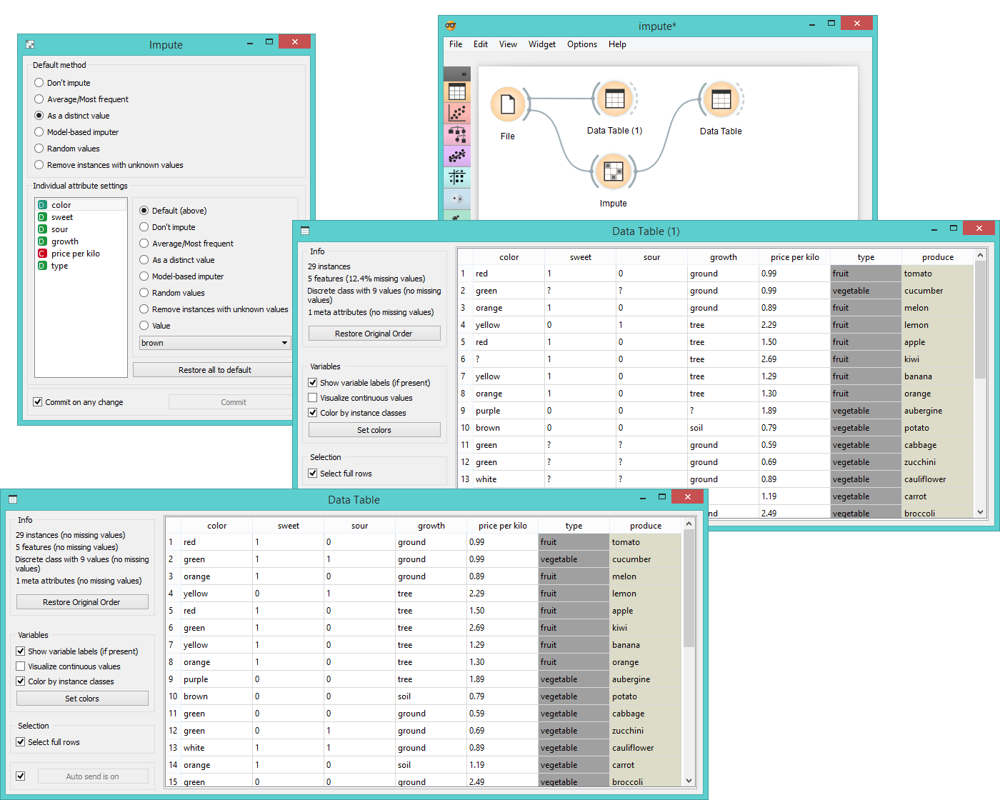

Impute
======

Replaces unknown values in the data.

Signals
-------

**Inputs**:

- **Data**

  Data set.

- **Learner for Imputation**

  A learning algorithm to be used when values are imputed with a predictive model. This algorithm, if given, substitutes the default (1-NN).

**Outputs**:

- **Data**

  The same data set as in the input, but with the missing values imputed.

Description
-----------

Some Orange’s algorithms and visualizations cannot handle unknown values
in the data. This widget does what statisticians call imputation: it
substitutes missing values by values either computed from the data or set by the user.

1. In the top-most box, *Default method*, the user can specify a
general imputation technique for all attributes.
   - **Don't Impute** does nothing with the missing values.
   - **Average/Most-frequent** uses the average value (for continuous attributes) or the most common value 
   (for discrete attributes).
   - **As a distinct value** creates new values to substitute the missing ones.
   - **Model-based imputer** constructs a model for predicting the missing value based on values of other attributes; a  
   separate model is constructed for each attribute. The default model is 1-NN learner, which takes the value from the most 
   similar example (this is sometimes referred to as hot deck imputation). This algorithm can be substituted by one that the 
   user connects to the input signal Learner for Imputation. Note, however, that if there are discrete and continuous 
   attributes in the data, the algorithm needs to be capable of handling them both; at the moment only 1-NN learner can do 
   that. (In the future, when Orange has more regressors, Impute widget may have separate input signals for discrete and 
   continuous models.)
   - **Random values** computes the distributions of values for each attribute and then imputes by picking 
   random values from them.
   - **Remove examples with missing values** removes the example containing missing values. 
   This check also applies to the class attribute if *Impute class values* is checked.
2. It is possible to specify individual treatment for each attribute
   which overrides the default treatment set. One can also specify a
   manually defined value used for imputation. In the snapshot,
   we decided not to impute the values of "*normalized-losses*" and "*make*",
   the missing values of "*aspiration*" will be replaced by random values,
   while the missing values of "*body-style*" and "*drive-wheels*" are 
   replaced by "*hatchback*" and "*fwd*", respectively. If the values of "*length*",
   "*width*" or "*height*" are missing, the example is discarded. Values of all
   other attributes use the default method set above (model-based imputer,
   in our case).
3. Imputation methods for individual attributes are the same as default methods.
4. *Restore All to Default* resets the individual attribute treatments to
the default.
5. All changes are committed immediately if *Commit on any change* is checked.
Otherwise, *Commit* needs to be clicked to apply any new settings.

Example
-------

To see how **Impute** widget works, we selected a very simple data set *fruits-and-veggies* containing
attributes for color, growth, price per kilo, whether they're sweet and/or sour and type. We see there
are some missing values present (marked with ?). To correct this we use the **Impute** widget and
select the desired imputation method (we went with *As a distinct value*).
In another **Data Table** we see how the questionmarks turned into distinct values ("green", "tree", 0 or 1...).

