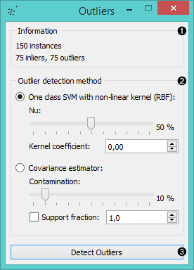

Outliers
========

Simple outlier detection by comparing distances between instances.

Signals
-------

**Inputs**:

- **Data**

  Data set.

- **Distances**

  Distance matrix.

**Outputs**:

- **Outliers**

  Data set containing instances scored as outliers.

- **Inliers**

  Data set containing instances not scored as outliers.

Description
-----------

**Outliers** widget applies one of the two methods for outlier detection. Both methods apply
classification to the data set, one with SVM (multiple kernels) and the other with elliptical
envelope.
*One-class SVM with non-linear kernels (RBF)* performs well with non-Gaussian distributions, while
*Covariance estimator* works only for data with Gaussian distribution.

1. Information on the input data, number of inliers and outliers based on the selected model.
2. Select the *Outlier detection method*:
   - **One class SVM with non-linear kernel (RBF)**: classifies data as similar or different from the core class
     - **Nu** is a parameter for the upper bound on the fraction of training errors and a lower 
       bound of the fraction of support vectors
     - **Kernel coefficient** is the gamma parameter, which specifies how much influence a single data instance has
   - **Covariance estimator**: fits ellipsis to central points with Mahalanobis distance metric
     - **Contamination** is the proportion of outliers in the data set
     - **Support fraction** specifies the proportion of points included in the estimate
3. Click *Detect outliers* to output the data.

Example
-------

Below is a simple example of how to use this widget. We use the *Iris* data set
to detect the outliers. We chose the *one class SVM with non-linear kernel (RBF)* method,
with Nu set at 20% (less training errors, more support vectors). Then we observe the outliers
in the **Data Table** widget, while we send the inliers to the **Scatter Plot**.

