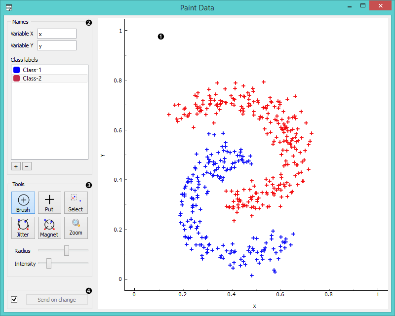

Paint Data
==========

Paints the data on a 2D plane. You can place individual data points or use a brush
to paint larger data sets.

Signals
-------

**Inputs**:

-   (None)

**Outputs**:

- **Data**

  Attribute-valued data set created in the widget.

Description
-----------

The widget supports the creation of the new data set by visually placing
data points on a two-dimension plane. Data points can be placed on
the plane individually (Put) or in a larger number by brushing (Brush).
Data points can belong to classes if the data is intended to be used in
supervised learning.

1. A 2D drawing canvas with fixed coordinate system.
2. Name the axes and selet the class to paint data instances. You can add or remove classes. Use one class only to create classless, unsupervised data sets.
3. Drawing tools. Paint data points with *Brush* (multiple data instances) or *Put* (individual data instance). Select data points with *Select* and remove them with Delete key. Reposition data points with *Jitter* (spread) and *Magnet* (focus). Use *Zoom* and scroll to zoom in or out. Below, set radius and intensity for Brush, Put, Jitter and Magnet tools.
4. Tick the box on the left to automacitally commit changes to other widgets. Alternatively, press '*Send*' 
  to apply them.

Example
-------

In the workflow below we have painted an unsupervised (class-less) data
set and sent it to **Data Table** and **K-Means Clustering** widget.
We have painted three clusters, which were, at least in a number of
clusters, correctly identified by the k-means clustering.

