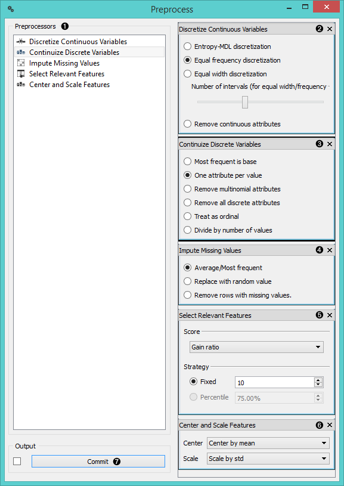

Preprocess
==========

Preprocesses the data with selected methods.

Signals
-------

**Inputs**:

- **Data**

  A data set.

**Outputs**:

- **Preprocessor**

  Preprocessing method.

- **Preprocessed Data**

  Data preprocessed with selected methods.

Description
-----------

Preprocessing is crucial for achieving better-quality analysis results. The **Preprocess** widget offers five preprocessing methods to improve data quality. In this widget you can immediately discretize continuous values or continuize discrete ones, impute missing values, select relevant features or center and scale them. Basically, this widget combines four separate widgets for simpler processing.

1. List of preprocessors
2. Discretization of continuous values
3. Continuization of discrete values
4. Impute missing values or remove them
5. Select the most relevant features by information gain, gain ratio, Gini index
6. Centering and scaling of features
7. Press '*Commit*' or select auto-commit (tick a box)

Example
-------

In the example below we have used *Iris* data set and preprocessed the data. We selected 3 most relevant features by Gini index, centered them by mean and scaled by span. In the **Distributions** widgets we see that the unprocessed data range from 0 to 7, while the preprocessed data range from -1 to 1, since they're scaled by span. In the *Data Table* we also see the three most relevant features according to the Gini index, which are *sepal length*, *petal width* and *sepal length* in our case.

