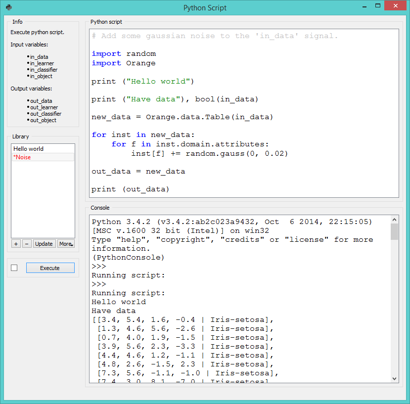

Python Script
=============

Signals
-------

**Inputs**:

- **in\_data (Orange.data.Table)**
  
  Input data set bound to `in_data` variable in the script’s local namespace.

- **in\_distance (Orange.core.SymMatrix)**

  Input symmetric matrix bound to `in_distance` variable in the script’s local namespace.

- **in\_learner (Orange.classification.Learner)**

  Input learner bound to `in_learner` variable in the script’s local namespace.

- **in\_classifier (Orange.classification.Learner)**

  Input classifier bound to `in_classifier` variable in the script’s local namespace.

- **in\_object (object)**

  Input python object bound to `in_object` variable in the script’s local namespace.

**Outputs**:

- **out\_data (Orange.data.Table)**

  Data set retrieved from `out_data` variable in the script’s local namespace after execution.

- **out\_distance (Orange.core.SymMatrix)**

  Symmetric matrix retrieved from `out_distance` variable in the script’s local namespace after execution.

- **out\_learner (Orange.classification.Learner)**

  Learner retrieved from `out_learner` variable in the script’s local namespace.

- **out\_classifier (Orange.classification.Learner)**

  Classifier retrieved from `out_classifier` variable in the script’s local namespace after execution.

- **out\_object (object)**

  Python object retrieved from `out_object` variable in the script’s local namespace after execution.

Description
-----------

**Python Script** widget can be used to run a python script in the inputs,
when a suitable functionality is not implemented in an existing widgets.
The scripts have `in_data`, `in_distance`, `in_learner`, `in_classifier`
and `in_object` variables (from input signals) in their local namespace.
If a signal is not connected or it did not yet receive any data, those
variables contain `None`.

After the script is executed `out_data`, `out_distance`, … variables
from the script’s local namespace are extracted and used as outputs of
the widget. The widget can be further connected to other widgets for visualizing the output.

For instance the following script would simply pass on all signals it
receives:

    out_data = in_data
    out_distance = in_distance
    out_learner = in_learner
    out_classifier = in_classifier
    out_object = in_object

> **Note**
>
> You should not modify the input objects in place.

The *Python script* editor on the left can be used to edit a script (it
supports some rudimentary syntax highlighting).

Pressing the *Execute* in the *Run* box executes the script (using `exec`).
Any script output (from `print`) is captured and displayed in the
*Console* below the script.

If *Auto execute* is checked, the script is run any time inputs to
the widget change.

Library
-------

The *Library* control can be used to manage multiple scripts.

Pressing "+" will add a new entry and open it in the *Python script*
editor. When the script is modified its entry in the *Library* will
change to indicate it has unsaved changes. Pressing *Update* will save the
script (keyboard shortcut ctrl + s). A script can be removed by
selecting it and pressing the "-" button.
