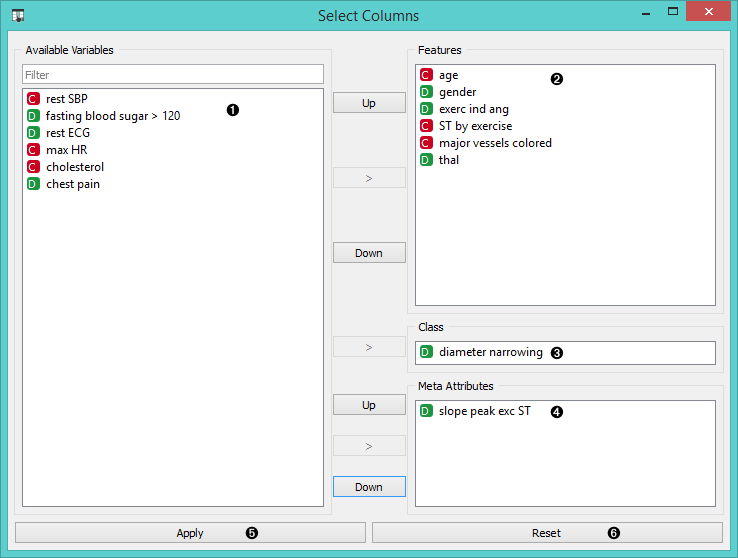
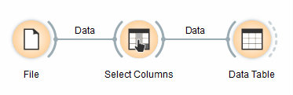
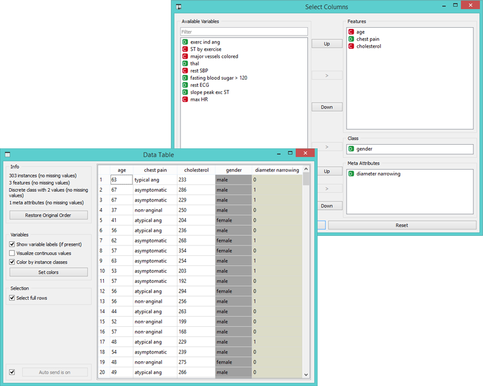

Select Columns
=================

Manual selection of data attributes and composition of data domain.

Signals
-------

**Inputs**:

- **Data**

  Attribute-valued data set.

**Outputs**:

- **Data**

  Attribute-valued data set composed using the domain specification from the widget.

Description
-----------

**Select Columns** widget is used to manually compose your data domain.
User can decide which attributes will be used and how. Orange
distinguishes between ordinary attributes, an (optional) class
attributes and meta attributes. For instance, for building a
classification model, the domain would be composed of a set of
attributes and a discrete class attribute. Meta attributes are not used
in modelling, but several widgets can use them for instance labels.

Orange attributes are typed and are either discrete, continuous or a
character string. The attribute type is marked with a symbol appearing
before the name of the attribute (D, C, S, respectively).

1. Left-out data attributes that will not be in the output data file.
2. Data attributes in the new data file.
3. A class attribute. If none, the new data set will be classless.
4. Meta attributes of the new data file. These attributes are included in the data set but are, for most of the methods, not considered in analysis.
5. Apply change of the data domain and send the new data file to the output channel of the widget.
6. Reset the domain composition to that of the input data file.

Example
-------

In a workflow below an input data from the **File** widget is fed to
**Select Columns** widget, which outputs the data to the **Data Table**.

We used the schema to redefine the classification problem in *heart
disease* data set. Originally, the task was to predict if the patient has
a coronary artery diameter narrowing. We changed the problem to that of
gender classification based on age, chest pain and cholesterol level,
and informatively kept the diameter narrowing as a meta
attribute.

