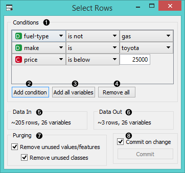
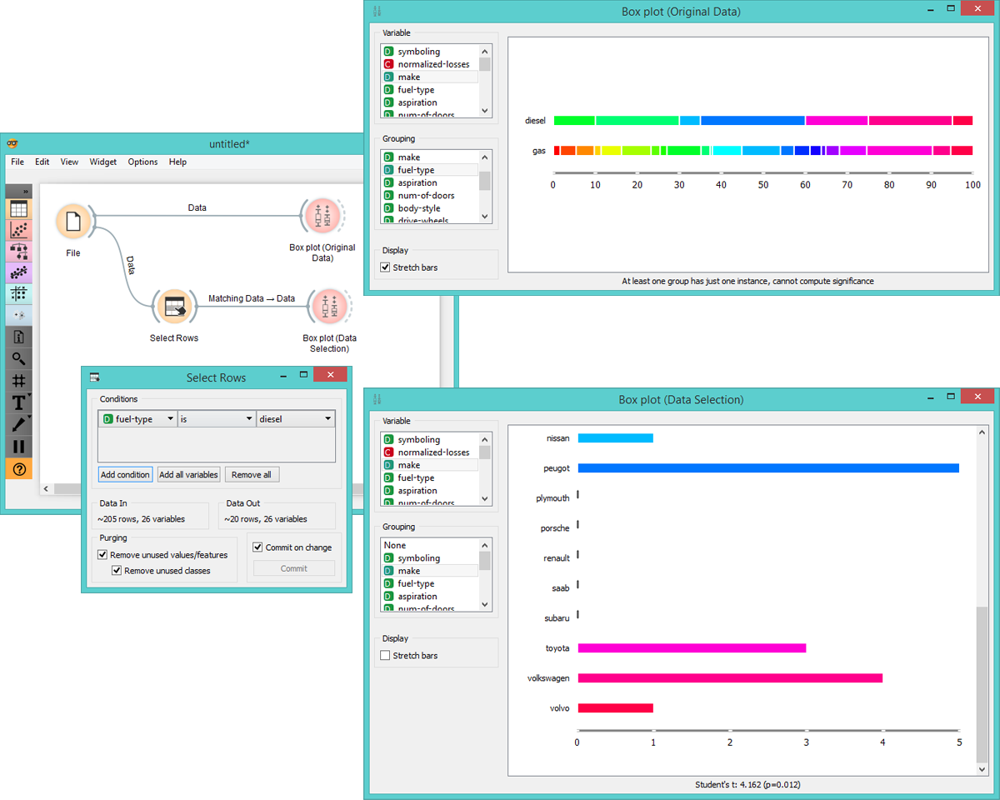

Select Rows
===========

Selects data instances based on conditions over data features.

Signals
-------

**Inputs**:

- **Data**

  Data set.

**Outputs**:

- **Matching Data**

  Instances that match the conditions.

- **Non-Matching Data**

  Instances that do not match the conditions.

Description
-----------

This widget selects a subset from the input data based on user-defined conditions. 
Instances that match the selection rule are placed in the output *Matching Data* channel.

Criteria for data selection are presented as a collection of conjuncted terms (i.e. selected items are those
matching all the terms in '*Conditions*').

Condition terms are defined through selecting of an attribute, selecting
an operator from the list of operators,
and, if needed, defining the value to be used in the condition term.
Operators are different for discrete, continuous and string attributes.

1. Conditions you want to apply, their operators and related values.
2. Add a new condition to the list of conditions.
3. Add all the possible variables at once.
4. Remove all the listed variables at once.
5. Information on the input data set.
6. Information on instances that match the condition(s).
7. Purge the output data.
8. When the 'Commit all change' box is ticked, all changes will be automatically communicated to other widgets.

Any change in composition of the condition will update the information pane (*Data Out*).

If *Commit on change* is selected, then the output is updated on any change 
in the composition of the condition or any of its terms.

Example
-------

![image] (images/SelectRows-schema.png)

In this example we used the car data from *imports-85* data set and
listed all the imported diesel cars by brand.

