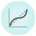
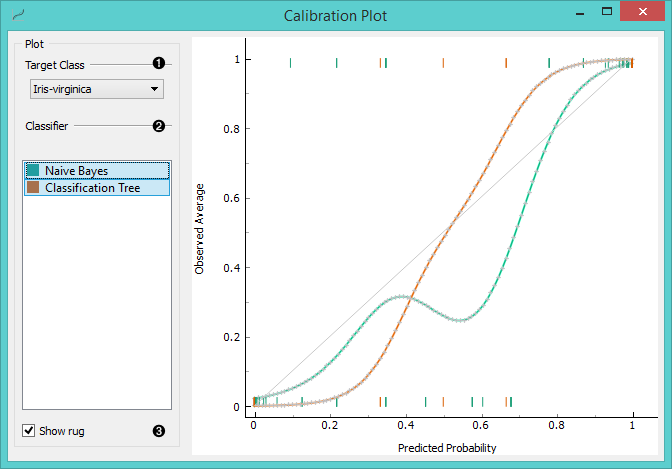
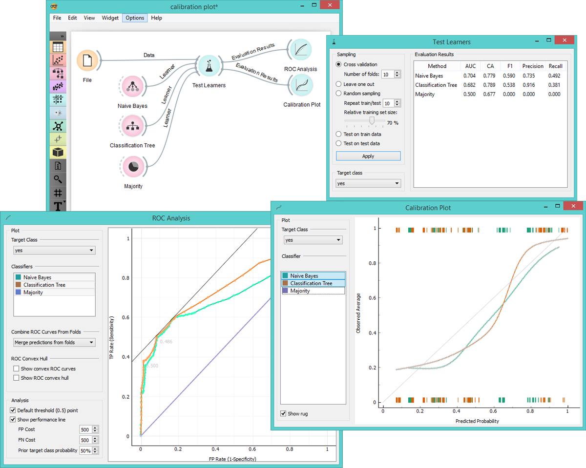

Calibration Plot
================

Shows the match between classifiers’ probability predictions and
actual class probabilities.

Signals
-------

**Inputs**:

- **Evaluation Results**

  Results of testing classification algorithms.

**Outputs**:

- None

Description
-----------

[**Calibration Plot**](https://en.wikipedia.org/wiki/Calibration_curve) plots class probabilities against those predicted
by the classifier(s).

1. Select the desired target class from the drop down menu.

2. Choose which classifiers to plot.

  The diagonal represents the optimal behaviour; the closer the classifier's curve
gets, the more accurate its prediction probabilities are. Thus we would use this widget to see whether a classifier
is overly optimistic (gives predominantly positive results) or pesimitistic (gives predominantly
negative results).

3. If *Show rug* is enabled, ticks are displayed at the bottom and the top of the graph,
which represent negative and positive examples (respectively). Their position
corresponds to classifier’s probability prediction and the color shows
the classifier. On the bottom of the graph, the points to the left are
those which are (correctly) assigned a low probability of the target
class, and those to the right are incorrectly assigned high
probabilities. On the top of the graph, the instances to the right are
correctly assigned high probabilities and vice versa.

Example
-------

At the moment, the only widget which gives the right type of signal
needed by the **Calibration Plot** is **Test Learners**. Calibration Plot
will hence always follow Test Learners and, since it has no outputs, no
other widgets follow it. 

Here is a typical example, where we compare three classifiers (namely **Naive Bayes**,
**Classification Tree** and **Majority**) and input them into **Test Learners**. Test Learners
then displays evaluation results for each classifier. Then we draw **Calibration Plot** and
**ROC Analysis** widgets from Test Learners to further analyze the performance of classifiers.
Calibration Plot enables you to see prediction accuracy of class probabilities in a plot.

