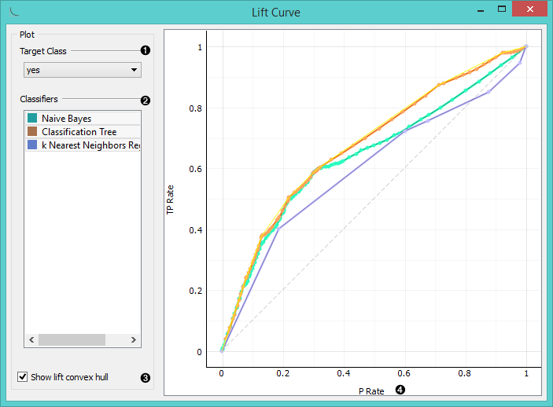
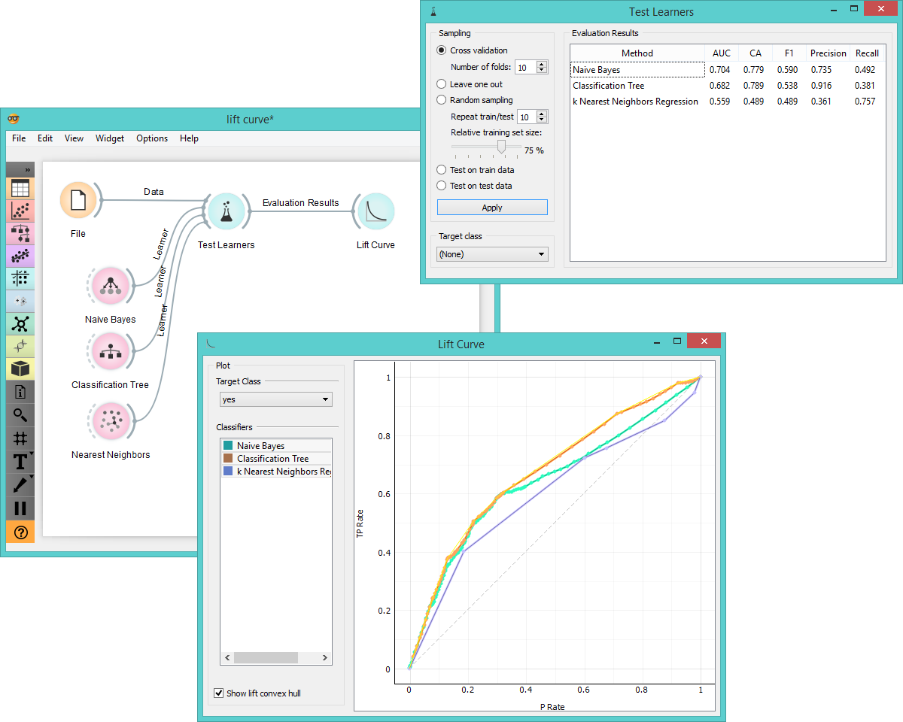

Lift Curve
==========

Measures the performance of a chosen classifier against a random classifier.

Signals
-------

**Inputs**:

- **Evaluation Results**

  Results of classifiers’ tests on data.

**Outputs**:

- None

Description
-----------

**Lift curve** shows the relation between the number of instances which were
predicted positive and those of them that are indeed positive and thus measures
the performance of a chosen classifier against a random classifier. The graph
is constructed with the cumulative number of cases (in descending order of probability)
on the x-axis and the cumulative number of true positives on the y-axis. Lift curve 
is often used in segmenting the population, e.g., plotting the
number of responding customers against the number of all customers
contacted. You can also determine the optimal classifier and its threshold from the graph.

1. Choose the desired *Target class*. Default class is chosen alphabetically.

2. If test results contain more than one classifier, the user can
choose which curves she or he wants to see plotted. Click on the classifier
to select or deselect the curve.

3. *Show lift convex hull* plots a convex hull over lift curves for all
classifiers (yellow curve). The curve shows the optimal classifier (or combination
thereof) for each desired TP/P rate.

4. 2-D pane with **P rate** (population) as x-axis and **TP rate** (true positives) as 
a y-axis. The diagonal line represents the behaviour of a random classifier. Click
and drag to move the pane and scroll in or out to zoom. Click on the "*A*" sign at the
bottom left corner to realign the pane.

**Note**: the perfect classifier would have a steep slope towards 1 until all classes
are guessed correctly and then run straight along 1 on y-axis to (1,1). 

Example
-------

At the moment, the only widget which give the right type of the signal
needed by the **Lift Curve** is **Test Learners**.

In the example below we try to see the prediction quality for the class 'survived' on *Titanic*
data set. We compared three different classifiers in Test Learners widget and sent them to
Lift Curve to see their performance against a random model. We see the **Classification Tree** classifier
is the best out of the three, since it best aligns with *lift convex hull*. We also see that its performance
is the best for the first 30% of the population (in order of descending probability),
which we can set as the threshold for optimal classification.

References
----------

Handouts of University of Notre Dame on Data Mining - Lift Curve. Available [here](https://www3.nd.edu/~busiforc/handouts/DataMining/Lift%20Charts.html).
