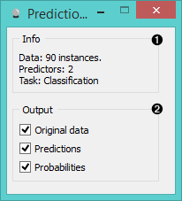
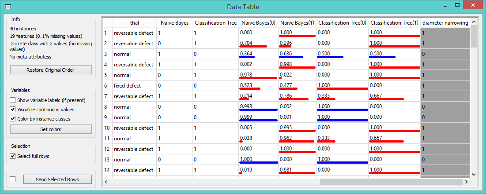
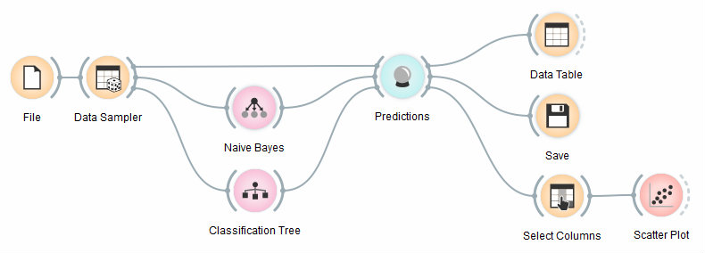
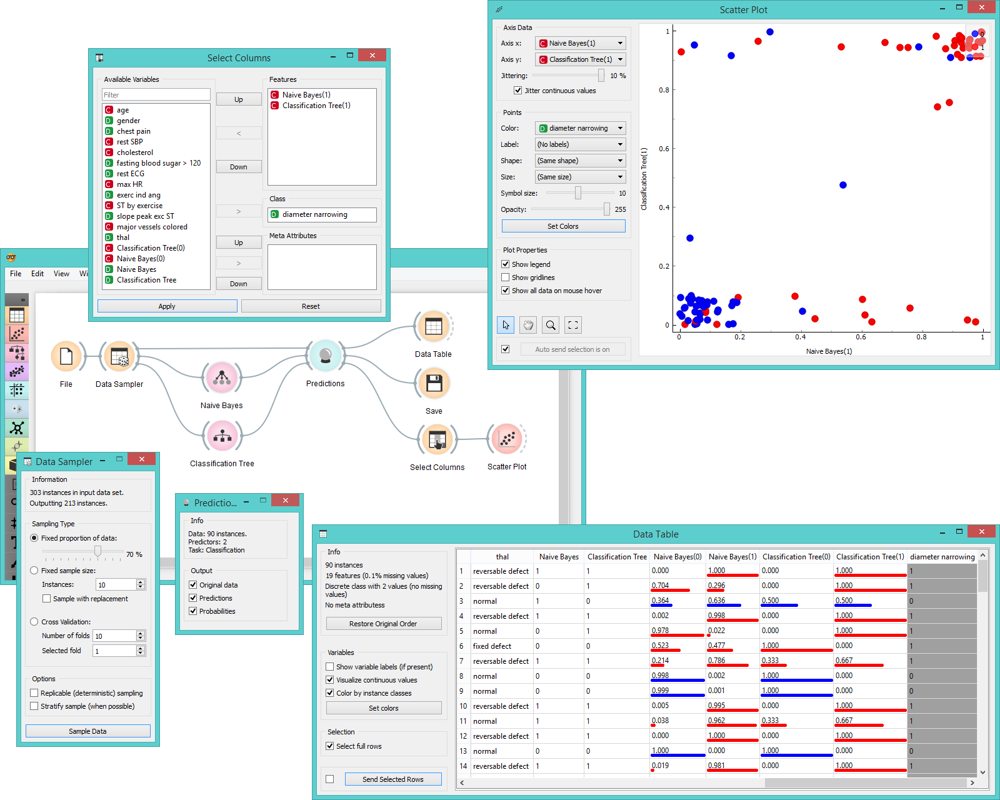

Predictions
===========

Shows classifiers' predictions on the data.

Signals
-------

**Inputs**:

- **Data**

  Data set.

- **Predictors**

  Predictors to be used on the data.

**Outputs**:

- **Predictions**

  Original data with added predictions.

Description
-----------

The widget receives a data set and one or more predictors (classifiers, not
learning algorithms - see the example below). It outputs the
data and the predictions.

1. Information on the input
2. Select the desired output

Despite its simplicity, the widget allows for quite an interesting analysis
of decisions of [predictive models](https://en.wikipedia.org/wiki/Predictive_modelling); there is a simple demonstration at
the bottom of the page. **Confusion Matrix** is a related widget and
although many things can be done with any of them,
there are tasks for which one of them might be much more convenient than
the other.

The output of the widget is another data set, where predictions are
appended as new meta attributes. You can select which features you wish to output
(original data, predictions, probabilities).

Example
-------

We randomly split the data into two subsets.
The larger subset, containing 70 % of data instances, is sent to *Naive Bayes*
and **Classification Tree**, so they can produce the corresponding
classifiers. Classifiers are then sent into **Predictions**, among with the
remaining 30 % of the data. Predictions shows how these examples are
classified.

The results of this procedure on the *heart disease* data are shown in the
**Data Table** snapshot. We see probabilities of class "1", class "0" and the predicted class
for both classifiers.

To save the predictions, we simply attach the **Save** widget to
**Predictions**. The final file is a data table and can be saved as
a .tab or .csv format.

Finally, we can analyze the classifier’s predictions. For that, we first take
**Select Columns** with which we move the meta attributes with
probability predictions to features. The transformed data is
then given to the **Scatterplot**, which we set to use the attributes with
probabilities as the x and y axes, while the class is (already by
default) used to color the data points.

To get the above plot, we selected *Jitter continuous values*,
since the classification tree gives just a few distinct probabilities.
The blue points in the bottom left corner represent the people with no diameter
narrowing, which were correctly classified by both classifiers. The
upper right red points represent the patients with narrowed vessels,
which were correctly classified by both.

Note that this analysis is done on a rather small sample, so these
conclusions may be ungrounded.
Here is the entire workflow:

Another example of using this widget is given in the documentation for
widget **Confusion Matrix**.

