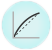
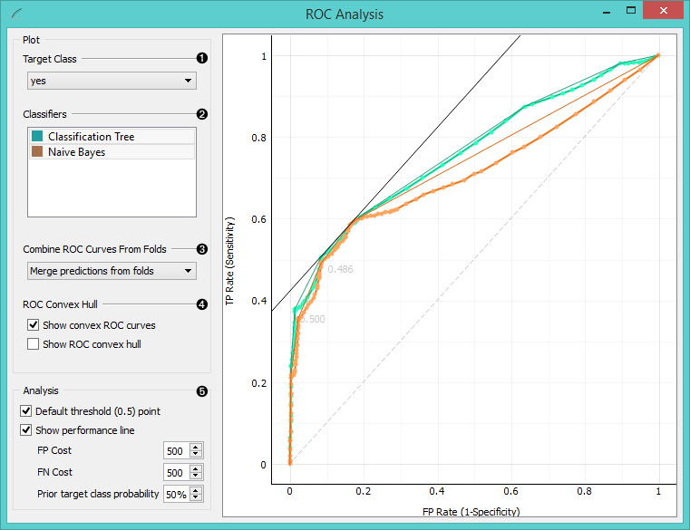
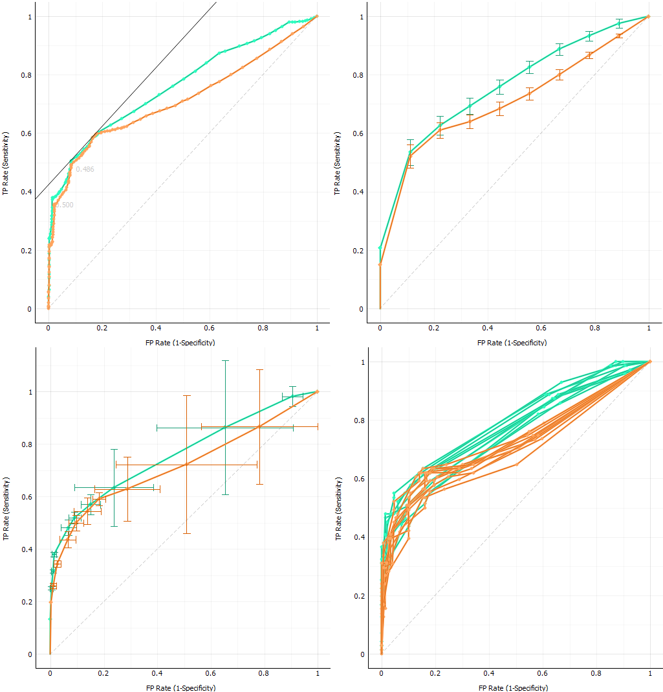
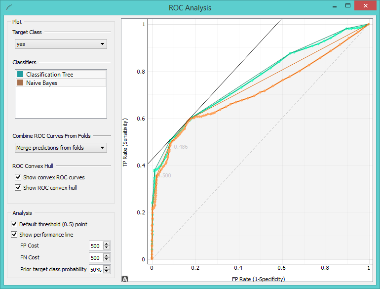
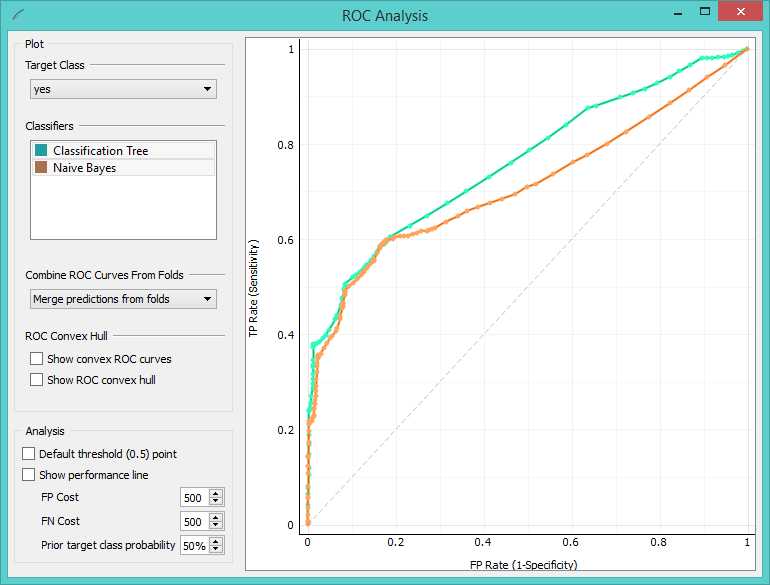
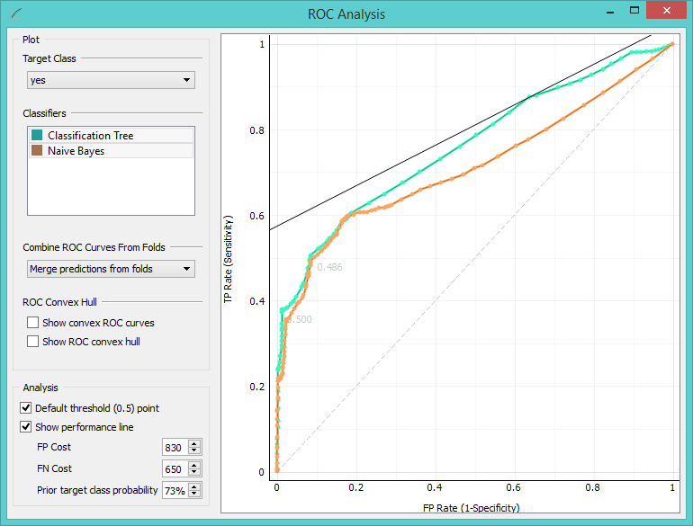
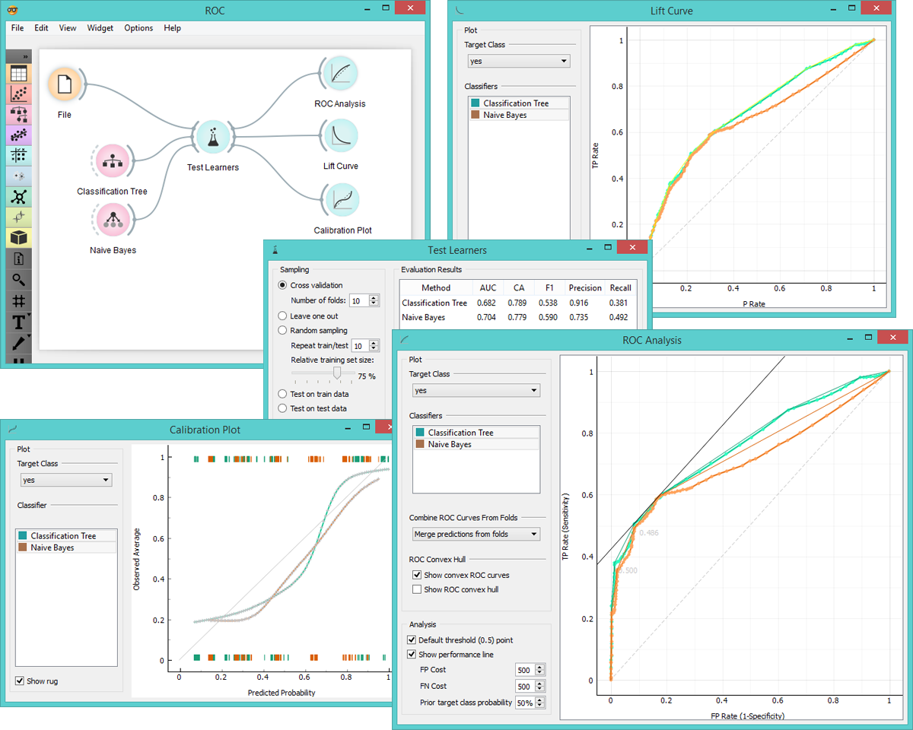

ROC Analysis
============

Plots a true positive rate against a false positive rate of a test.

Signals
-------

**Inputs**:

- **Evaluation Results**

  Results of classifiers’ tests on data

**Outputs**:

- None

Description
-----------

The widget shows ROC curves for the tested models and the corresponding
convex hull. It serves as a mean of comparison between classification models.
The curve plots a false positive rate on an x-axis (1-specificity; probability
that target=1 when true value=0) against a true positive rate on a y-axis (sensitivity;
probability that target=1 when true value=1). The closer the curve follows the left-hand border
and then the top border of the ROC space the more accurate the classifier.
Given the costs of false positives and false negatives, the widget
can also determine the optimal classifier and threshold.

1. Choose the desired *Target Class*. Default class is chosen alphabetically.

2. If test results contain more than one classifier, the user can
  choose which curves she or he wants to see plotted. Click on a classifier to
  select or deselect it.

3. When the data comes from multiple iterations of training and testing,
  such as k-fold cross validation, the results can be (and usually are)
  averaged.

  

  The averaging options are:

    - **Merge predictions from folds** (top left), which treats all the test data as if they came from a single iteration
    - **Mean TP rate** (top right) averages the curves vertically, showing the corresponding confidence intervals
    - **Mean TP and FP at threshold** (bottom left) traverses over threshold, averages the positions of curves and shows horizontal and vertical confidence intervals
    - **Show individual curves** (bottom right) does not average but prints all the curves instead

4. Option *Show convex ROC curves* refers to convex curves over each individual
  classifier (the thin lines positioned over curves). *Show ROC convex hull*
  plots a convex hull combining all classifiers (the gray area below the curves).
  Plotting both types of convex curves makes sense
  since selecting a threshold in a concave part of the curve cannot yield
  optimal results, disregarding the cost matrix. Besides, it is possible
  to reach any point on the convex curve by combining the classifiers
  represented by the points at the border of the concave region.

  

  The diagonal dotted line represents the behaviour of a random classifier.
  The full diagonal line represents iso-performace. A black "*A*" symbol at the
  bottom of the graph proportionally readjusts the graph.

5. The final box is dedicated to the analysis of the curve. The
  user can specify the cost of false positives (FP) and false negatives (FN), and
  the prior target class probability.

  *Default threshold (0.5) point* shows the point on the ROC curve achieved
  by the classifier if it predicts the target class if its probability
  equals or exceeds 0.5.

  *Show performance line* shows iso-performance in the ROC space so that all the points on
  the line give the same profit/loss. The line further to the upper left is
  better than the one down and right. The direction of the line depends upon
  costs and probabilities. This gives a recipe for
  depicting the optimal threshold for the given costs: this is the point
  where the tangent with the given inclination touches the curve and it is marked in the plot.
  If we push the iso-performance higher or more to the left, the points on the iso-performance line cannot
  be reached by the learner. Going down or to the right, decreases the
  performance.

  The widget allows setting the costs from 1 to 1000. Units are not
  important, as are not the magnitudes. What matters is the relation
  between the two costs, so setting them to 100 and 200 will give the same
  result as 400 and 800.

  

  Defaults: both costs equal (500), Prior target class probability 50% (from the data).

  

  False positive cost: 830, False negative cost 650, Prior target class probability 73%.

Example
-------

At the moment, the only widget which gives the right type of signal
needed by the **ROC Analysis** is **Test Learners**. Below we compare two classifiers,
namely **Classification Tree** and **Naive Bayes**, in **Test Learners** and then
compare their performance in **ROC Analysis**, **Life Curve** and **Calibration Plot**.

