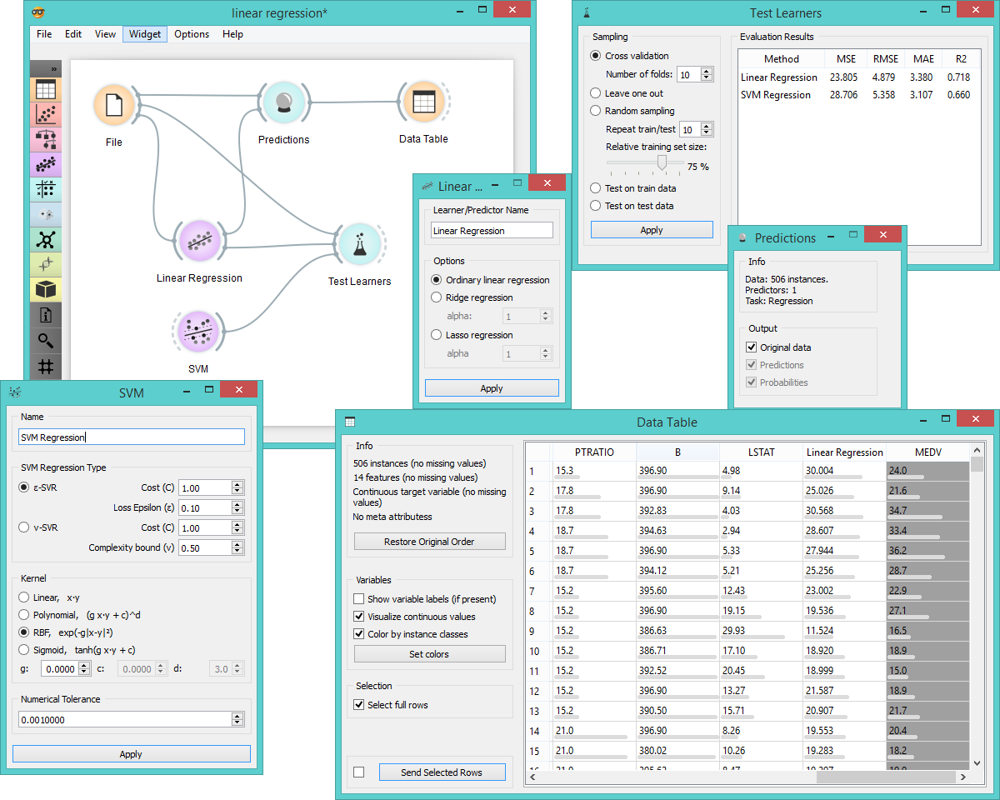

Linear Regression
=================

Learns a linear function of its input data.

Signals
-------

**Inputs**:

- **Data**

  Data set

- **Preprocessor**

  Preprocesed data set.

**Outputs**:

- **Learner**

  Learning algorithm with the supplied parameters

- **Predictor**

  Trained regressor. Signal *Predictor* sends the output signal only if signal *Data* is present.

Description
-----------

**Linear Regression** widget constructs a learner/predictor that learns a
[linear function](https://en.wikipedia.org/wiki/Linear_regression) from its input data. The model can identify the relationship between
a predictor xi and the response variable y. Additionally [*Lasso*](https://en.wikipedia.org/wiki/Least_squares#Lasso_method) and [*Ridge*](https://en.wikipedia.org/wiki/Tikhonov_regularization)
regularization parameters can be specified. Lasso regression minimizes a penalized version of the least squares
loss function with L1-norm penalty and Ridge regularization with L2-norm penalty.

1. The learner/predictor name
2. Choose a model to train:
    - an ordinary least squares (linear regression) model,
    - a [Ridge](https://en.wikipedia.org/wiki/Least_squares#Lasso_method) regularization (L2-norm penalty)
    - a [Lasso](https://en.wikipedia.org/wiki/Least_squares#Lasso_method) bound (L1-norm penalty)
3. Press *Apply* to commit changes.

Example
-------

Below is a simple workflow showing how to use both the *Predictor* and the *Learner* output. For the *Predictor* we input
the prediction model into **Predictions** widget and view the results in **Data Table**. For *Learner* we can compare
different learners in **Test Learners** widget.

