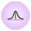
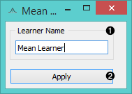
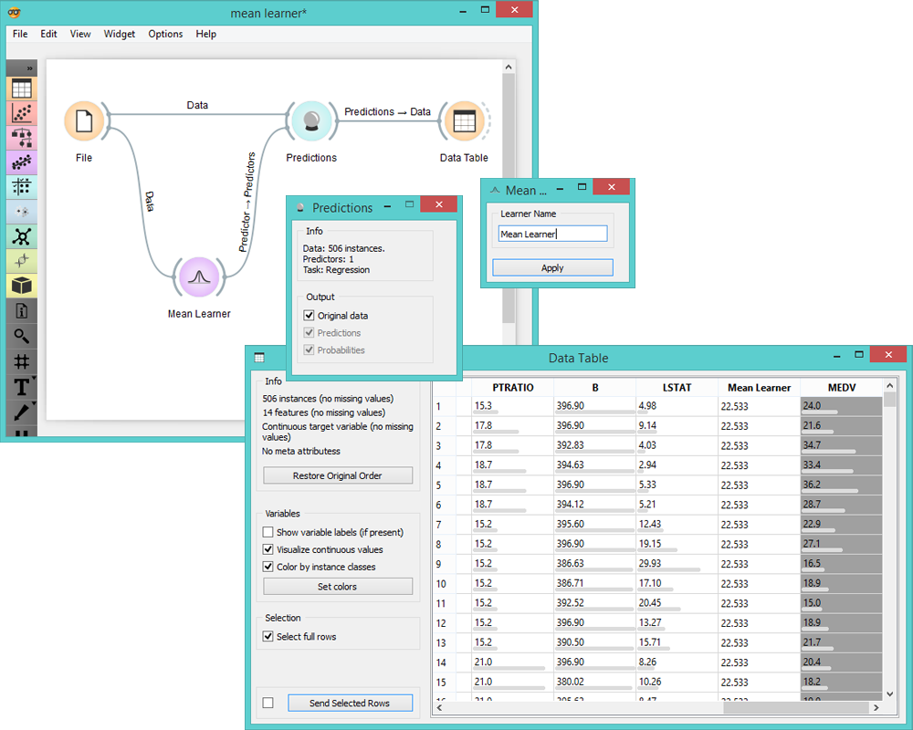
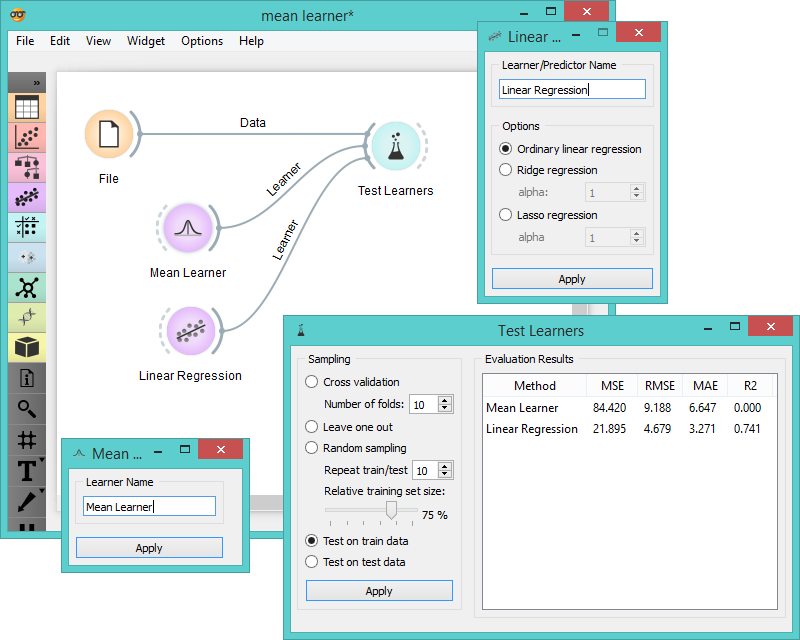

Mean Learner
============

Learns the mean of its input data.

Signals
-------

**Inputs**:

- **Data**

  Data set.
  
- **Preprocessor**

  Preprocessed data.

**Outputs**:

- **Learner**

  Mean learning algorithm.

- **Predictor**

  Trained regressor. Signal *Predictor* sends the regressor only if signal *Data* is present.

Description
-----------

This is the simplest learner widget for regression problems. It *learns*
the mean of the class variable and returns a predictor with the same [mean value](https://en.wikipedia.org/wiki/Mean).
This widget can serve as a baseline for other regression models due to its accuracy.

1. Learner/predictor name.
2. *Apply* button commits changes to the output.

Examples
--------

In the first example we use **Mean Learner** to construct a predictor and input it into the **Data Table**. In the table
you can see an extra column *Mean Learner* with one (mean) value for all instances.

Another way to use **Mean Learner** is to compare it to other learners in **Test Learners** widget.

