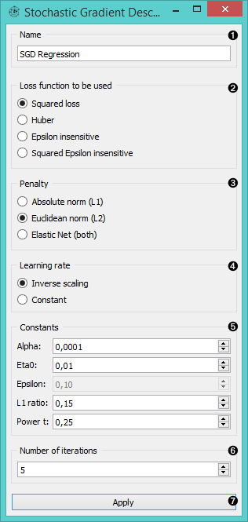
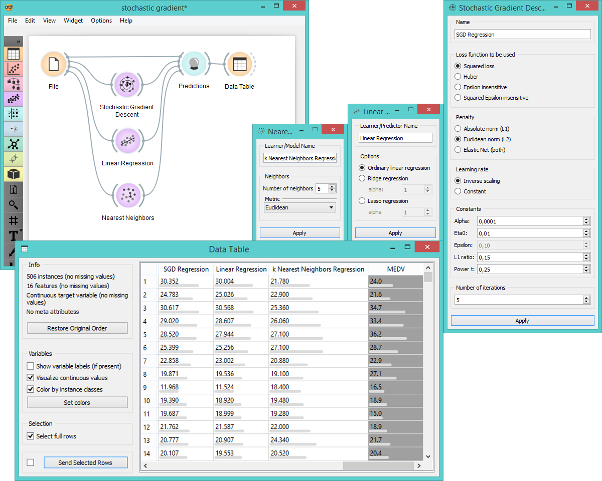

Stochastic Gradient Descent
===========================

Learns a linear classifier by minimizing a chosen loss function.

Signals
-------

**Inputs**:

- **Data**

  Data set.

- **Preprocessor**

  Preprocessed data.

**Outputs**:

- **Learner**

  Learning algorithm with the supplied parameters

- **Predictor**

  Trained regressor. Signal *Predictor* sends the output signal only if input *Data* is present.

Description
-----------

**Stochastic Gradient Descent** widget uses [stochastic gradient descent](https://en.wikipedia.org/wiki/Stochastic_gradient_descent) that minimizes a chosen loss function with a
linear function. The algorithm approximates true gradient by considering one sample at a time and simultaneously updates the 
model based on the gradient of the loss function. This regression returns predictors as minimizers of the sum, i.e. 
M-estimators, and is especially useful for large-scale and sparse data sets.

1. Learner/predictor name
2. Loss functions:
  - [*Squared Loss*](https://en.wikipedia.org/wiki/Mean_squared_error#Regression) (fitted to ordinary least-squares)
  - [*Huber*](https://en.wikipedia.org/wiki/Huber_loss) (switches to linear loss beyond &epsilon;)
  - [*Epsilon insensitive*](http://kernelsvm.tripod.com/) (ignores errors within &epsilon;, linear beyond it)
  - *Squared epsilon insensitive* (loss is squared beyond &epsilon;-region).
3. Regularization norms to prevent overfitting:
  - [**Absolute norm**](https://en.wikipedia.org/wiki/Taxicab_geometry) (L1, leading to sparse solutions)
  - [**Euclidean norm**](https://en.wikipedia.org/wiki/Norm_(mathematics)#p-norm) (L2, standard regularizer)
  - [**Elastic net**](https://en.wikipedia.org/wiki/Elastic_net_regularization) (mixing both penalty norms).
4. Use the default [*Inverse scaling*](http://users.ics.aalto.fi/jhollmen/dippa/node22.html) for the learning rate to be inversely related to the number of iterations or select *Constant* for LR to stay the same through all epochs (passes).
5. Set constants for [regression algorithm](https://en.wikipedia.org/wiki/Regression_analysis):
  - **Alpha**: constant learning rate
  - **Eta0**: initial learning rate
  - **Epsilon**: determing the error threshold (off for squared loss)
  - **L1 ratio**: mixing parameter for *Elastic Net* penalty
  - **Power t**: exponent for inverse scaling learning rate, t is time step
6.The number of passes through training data.
7. Press *Apply* to commit changes.

Example
-------

Below we compare three different regression models to see which predict what kind of results. We connect the **File** widget to **Stochastic Gradient Descent**, **Linear Regression** and **Nearest Neighbors** widget and all four to the **Predicitions** widget. Then we use **Data Table** to see what predicitions each model makes.

