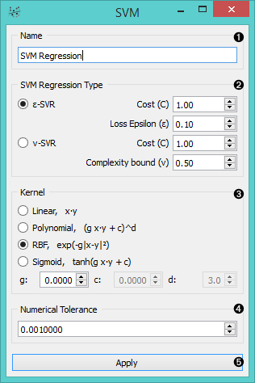
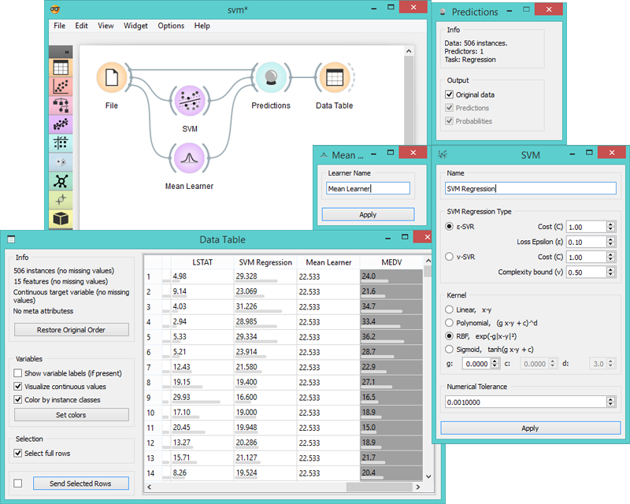

SVM Regression
==============

Learns a SVM regression of its input data.

Signals
-------

**Inputs**:

- **Data**

  Data set.

- **Preprocessor**

  Preprocessed data.

**Outputs**:

- **Learner**

  SVM learning algorithm with supplied parameters.

- **Predictor**

  Trained regressor. Signal *Predictor* sends the regressor only if signal *Data* is present.

Description
-----------

**SVM Regression** performs linear regression in the high dimension feature space using an &epsilon;-intensive loss. Its
estimation accuracy depends on a good setting of C, &epsilon; and kernel parameters. The widget outputs class
predictions based on the [SVM learning algorithm](https://en.wikipedia.org/wiki/Support_vector_machine#Regression).

1. Learner/predictor name.
2. Train an &epsilon;-SVR or v-SVR model and set test error bounds.
3. Set kernel, a function that transforms attribute space to a new feature space to fit the
  maximum-margin hyperplane, thus allowing the algorithm to create
  non-linear regressors. The first kernel in the list, however, is a
  [*Linear*](https://en.wikipedia.org/wiki/Linear_model) kernel that does not require this trick, but all the others
  ([*Polynomial*](https://en.wikipedia.org/wiki/Polynomial_kernel), [*RBF*](https://en.wikipedia.org/wiki/Radial_basis_function_kernel) and [*Sigmoid*](http://crsouza.com/2010/03/kernel-functions-for-machine-learning-applications/#sigmoid)) do. Functions that specify the
  kernel are presented besides their names, and the constants involved are:
    - **g** for the gamma constant in kernel function (the recommended value is
    1/k, where k is the number of the attributes, but since there may be no
    training set given to the widget the default is 0 and the user has to
    set this option manually),
    - **c** for the constant c0 in the kernel function (default 0), and
    - **d** for the degree of the kernel (default 3).
4. Set permitted deviation from the expected value.
5. Press *Apply* to commit changes.

Example
-------

Below we use two regression models to compare predictions in **Predictions** widget, which
can be then seen in **Data Table** as new columns with prediction values as instances.

