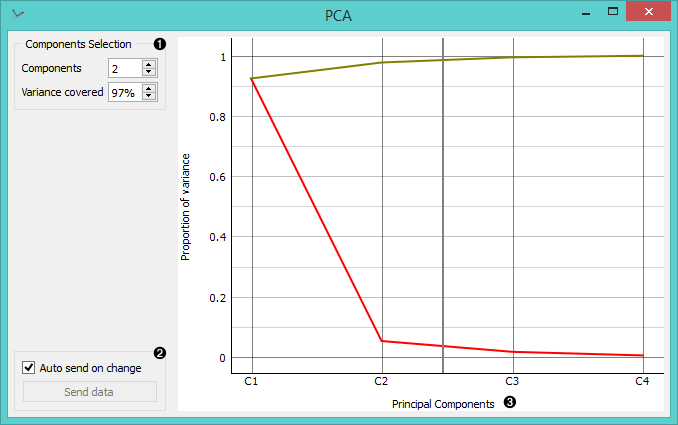

PCA
===

Principal Component Analysis linear transformation of input data.

Signals
-------

**Inputs**:

- **Data**

  Data set

**Outputs**:

- **Transformed Data**

  PCA transformed input data.

- **Components**

  [Eigenvectors](https://en.wikipedia.org/wiki/Eigenvalues_and_eigenvectors).

Description
-----------

[Principal Component Analysis](https://en.wikipedia.org/wiki/Principal_component_analysis) (PCA) computes the PCA linear
transformation of the input data.

The number of components of the transformation can be selected using
either the *Components Selection** input box or by dragging the vertical
cutoff line in the graph.

Examples
--------

PCA can be used to simplify visualizations of large data sets and select the most relevant attributes in a data set. Below we
used *Iris* data set to show how we can improve the visualization of the data set with PCA. The transformed data scatter plot
shows a much clearer distinction between classes than default settings.

The widget provides two outputs: transformed data and principal components. Transformed 
data are weights for individual instances in the new coordinate system, while components are the system descriptors
(weights for princial components).
When fed into the **Data Table**, we can see both outputs in a numerical form.

