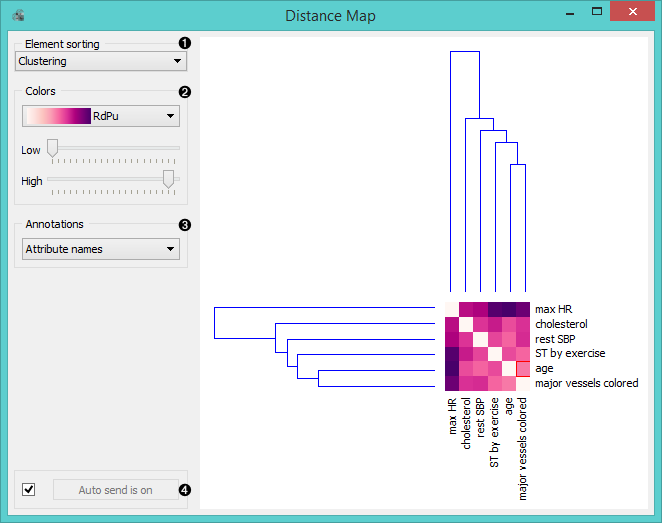
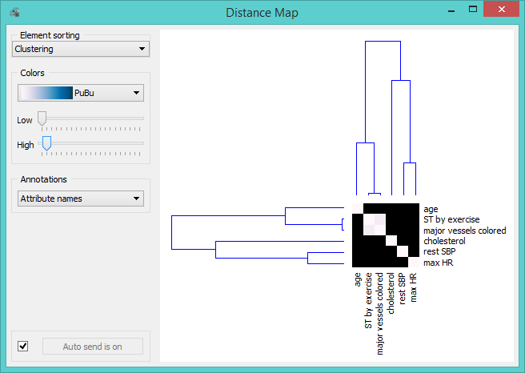
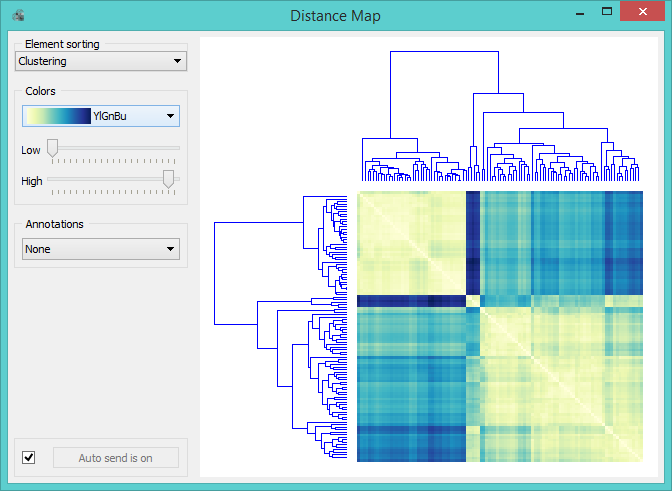
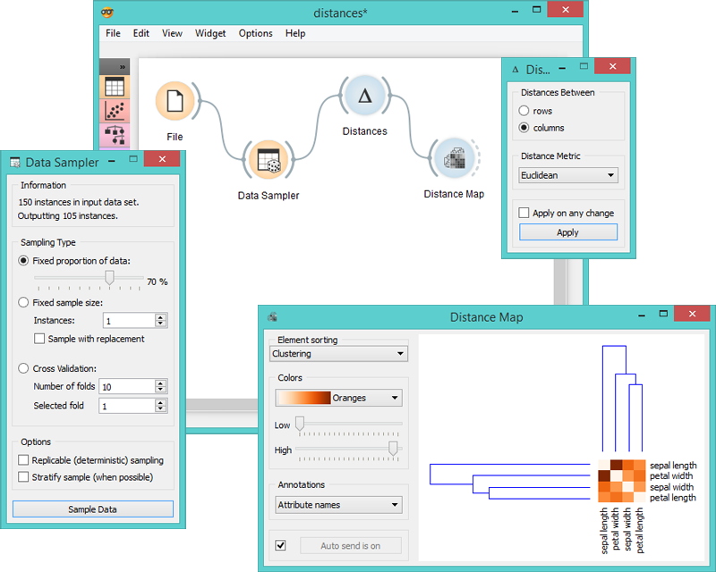
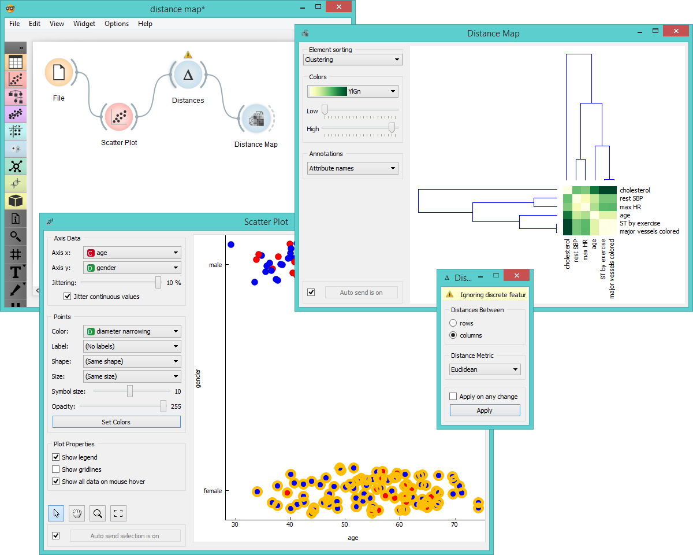

Distance Map
============

Visualizes distances between items.

Signals
-------

**Inputs**:

- **Distances**

  A distance matrix.

**Outputs**:

- **Data**

  Instances corresponding to the selected elements of the matrix.

- **Features**

  Attributes corresponding to the selected elements of the matrix.

Description
-----------

**Distance Map** is a visualization of distances between objects. The
visualization is rather simple: it is the same as if we printed out a
table of numbers, except that the numbers are replaced by spots colored
with the specified palette.

Distances are most often those between instances ("*rows*" in **Distances** widget)
or attributes ("*columns*" in **Distances** widget). The only suitable input for **Distance Map**
is **Distances** widget. For the output the user can select a region of the map and
the widget will output the corresponding instances or attributes.
Also note that the widget ignores discrete values and calculates
distances only for continuous data.

The snapshot shows distances between columns in the *heart disease*
data, where smaller distances are represented with white and larger with dark purple.
The matrix is symmetric and the diagonal is white - no attribute is different from itself.
Symmetricity is always assumed, while the diagonal may also be non-zero.

1. *Element sorting* arranges elements in the map by:
    - None (lists instances as found in the data set)
    - **Clustering** (clusters data by similarity)
    - **Clustering with ordered leaves** (maximizes the sum of similarities of adjacent elements)

2. *Colors*:
    - **color scale** (select the color palette for your distance map)
    - **low** (exposes instances or attributes with low correlation)
    - **high** (exposes instances or attributes with high correlation)

3. *Select annotations* shows and hides the item names besides the map:
    - None (doesn't display annotations)
    - **Enumeration** (displays correlation factors as annotations)
    - **By attribute** (displays the selected attribute as annotation)

4.  If *Auto send is on*, the data subset is communicated
automatically, otherwise you need to press *Send data*.

Normally, the color palette is used to
visualize the entire range of distances appearing in the matrix. This
can be changed by setting the low and high threshold. In this way we expose 
the distances outside this interval, so the *Colors* box can be used for visualizing the
interesting part of the distribution.

Below we exposed the most correlated attributes by setting the color
of high distances to the minimum. We get a predominantly black square
where attributes with the lowest distance scores are exposed. Besides the
diagonal line we see that in our example *ST by exercise* and *major vessels
colored* are the two attributes closest together.

The user can select a region in the map with the usual click-and-drag of the cursor.
When a part of the map is selected, the widget outputs all
items from the selected cells.

Another option is to select "*rows*" instead of "*columns*" in the **Distances** widget.
This will display distances between rows in the **Distance Map**. Here is an example:

Examples
========

The first workflow shows a very standard use of the **Distance Map** widget. We 
select 70% of the original *Iris* data as our sample and view the distances between
columns in **Distance Map**.

In the second example we use the *heart disease* data and select a subset of
women only from the **Scatter Plot**. Then we visualize distances between columns
in the **Distance Map**. Since the subset contains also some discrete data,
**Distances** widget warns us it will ignore discrete features, thus we will
see only continuous instances/attributes in the map.

