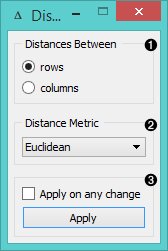
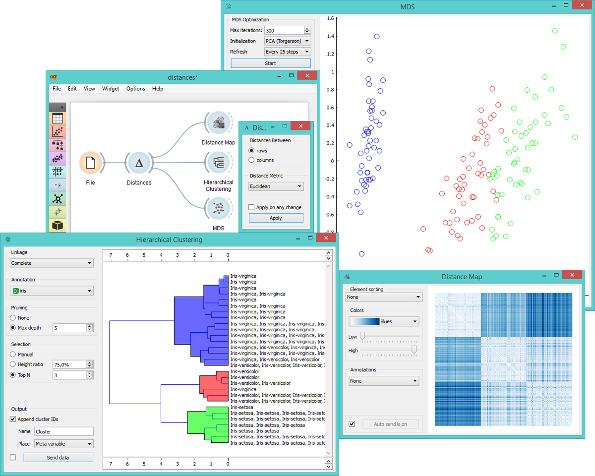

Distances
=========

Computes distances between rows/columns in the data set.

Signals
-------

**Inputs**:

- **Data**

  Data set

**Outputs**:

- **Distances**

  Distance matrix

Description
-----------

Widget Distances computes the distances between either the rows
or columns in the data set.

1. Choose which distances to measure, between rows or columns.

2. Choose the *Distance Metric*:
    - [**Euclidean**](https://en.wikipedia.org/wiki/Euclidean_distance) ("straight line", distance between two points)
    - [**Manhattan**](https://en.wiktionary.org/wiki/Manhattan_distance) (the sum of absolute differences for all attributes)
    - [**Cosine**](https://en.wikipedia.org/wiki/Cosine_similarity) (the cosine of the angle between two vectors of an inner product space)
    - [**Jaccard**](https://en.wikipedia.org/wiki/Jaccard_index) (the size of the intersection divided by the size of the union of the sample sets)
    - [**Spearman**](https://en.wikipedia.org/wiki/Spearman's_rank_correlation_coefficient) (linear correlation between the rank of the values)
    - [**Spearman absolute**](https://en.wikipedia.org/wiki/Spearman's_rank_correlation_coefficient) (linear correlation between the rank of the absolute values)
    - [**Pearson**](https://en.wikipedia.org/wiki/Pearson_product-moment_correlation_coefficient) (linear correlation between the values)
    - [**Pearson absolute**](https://en.wikipedia.org/wiki/Pearson_product-moment_correlation_coefficient) (linear correlation between the absolute values)

  In case of missing values the widget automatically imputes the average value of the row or the column.

  Since the widget cannot compute distances between discrete and
  continuous attributes, it only uses continuous attributes and ignores the discrete ones.
  If you want to put the discrete attributes to use, continuize them
  with **Continuize** widget first.
  
3. Tick '*Apply on any change*' to automacitally commit changes to other widgets. Alternatively, press '*Apply*' to apply them.

Example
-------

This is an intermediate widget: it needs to be fed into another widget to display results,
for instance **Distance Map** to visualize distances in a map, **Hierarchical Clustering** to cluster the attributes,
or **MDS** to visualize the distances in a plane.

