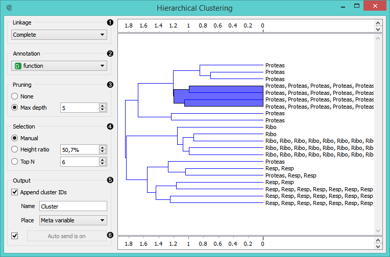
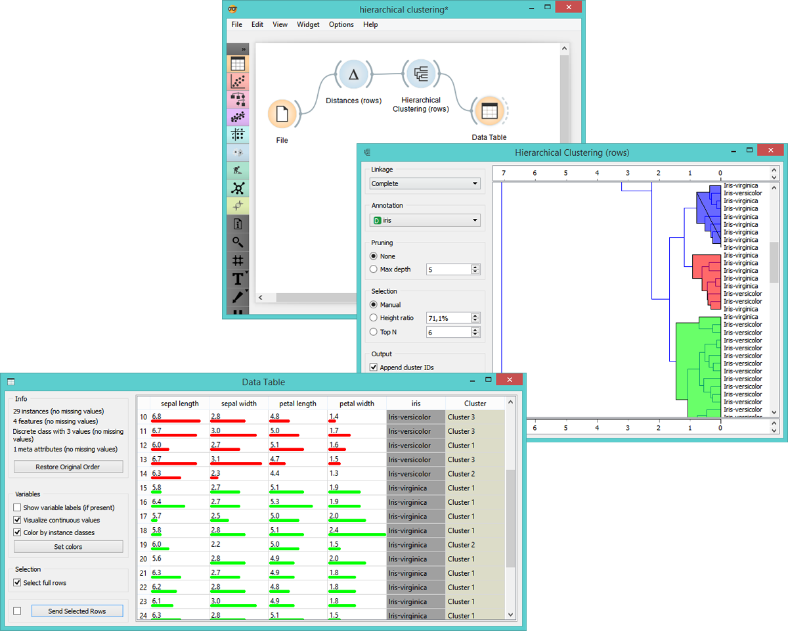
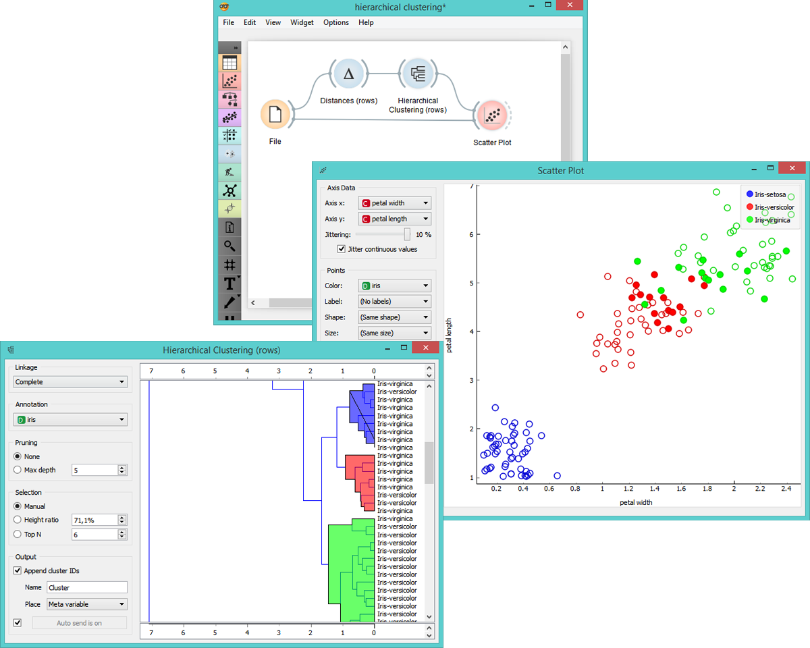

Hierarchical Clustering
=======================

Groups items using a hierarchical clustering algorithm.

Signals
-------

**Inputs**:

- **Distances**

  Distance matrix

**Outputs**:

- **Selected Data**

  Data subset

- **Other Data**

  Remaining data

Description
-----------

The widget computes [hierarchical clustering](https://en.wikipedia.org/wiki/Hierarchical_clustering) of arbitrary types of
objects from the matrix of distances between them and shows the
corresponding [dendrogram](https://en.wikipedia.org/wiki/Dendrogram).

1. The widget supports four kinds of linkages:
    - **Single linkage** is the distance between the closest elements of the two clusters
    - **Average linkage** computes the average distance between elements of the two clusters
    - **Weighted linkage** computes the weighted distance between elements of the two clusters
    - **Complete linkage** is the distance between clusters' most distant elements

2. Nodes of the dendrogram can be labeled in**Annotation** box. What the labels are depends upon
  the items being clustered. When clustering attributes, the
  labels are obviously the attribute names. When clustering instances, we
  can use the values of one of the attributes, typically the one that gives the
  name or the id of an instance, as labels.

3. Huge dendrograms can be pruned in the *Pruning* box by
  selecting the maximum depth of the dendrogram. This only affects the displayed
  dendrogram, not the actual clustering.

4. Widget offers three different selection methods:
    - **Manual** (Clicking inside the dendrogram will select a cluster. Multiple clusters can be selected by
    holding Ctrl. Each selected cluster is shown in different color and is
    treated as a separate cluster in the output.)
    - **Height ratio** (Clicking on the bottom or top ruler of the dendrogram places a
    cutoff line in the graph. Items to the right of the line are selected.)
    - **Top N** (Selects the number of top nodes.)

5. If the items being clustered are instances, they can be added a cluster
  index (*Append cluster IDs*). The ID can appear as an ordinary **Attribute**,
  **Class attribute** or a **Meta attribute**. In the second
  case, if the data already has a class attribute, the original class is
  placed among meta attributes.

  The data can be automatically output on any change (*Auto send is on*) or, if the box
  isn't ticked, by pushing *Send Data*.

Examples
========

The schema below computes clustering of attributes (columns). We see that if we choose *Append
cluster IDs*, we can see an additional column in the **Data Table** named *Cluster*. This is a way to
check how hierarchical clustering clustered individual instances.

We loaded the *Iris* data set. Below is the clustering of instances
and the nodes are annotated by the Iris' subvarieties. We connected the
**Scatter Plot** showing all the instances from the file, while the signal from
**Hierarchical clustering** is used as a subset. This way, we can
observe the position of the selected cluster(s) in the projection.

