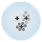
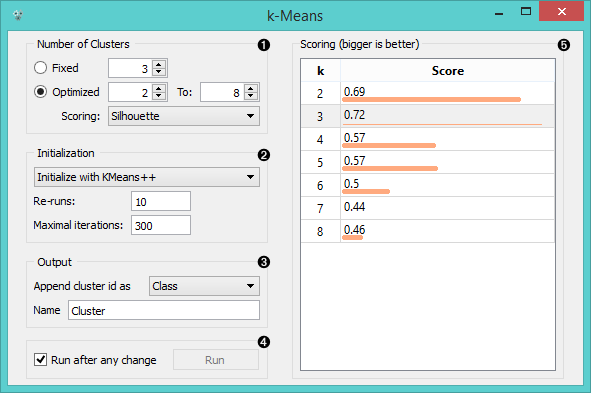

k-Means
=======

Groups items using the k-Means clustering algorithm.

Signals
-------

**Inputs**:

- **Data**

  Data set

**Outputs**:

- **Data**

  Data set with cluster index as a class attribute.

Description
-----------

The widget applies k-Means clustering algorithm to the data
and outputs a new data set in which the cluster index is used as
a class attribute. The original class attribute, if it existed, is
moved to meta attributes. The basic information on the clustering
results is also shown in the widget.

1. Select the number of clusters.
    - **Fixed**: algorithm clusters data in a specified number of clusters.
    - **Optimized**: algorithm returns possible clusters within the selected cluster range with appended scoring (bigger is better).
      - [**Silhouette**](https://en.wikipedia.org/wiki/Silhouette_(clustering)) (contrasts average distance to elements in the same cluster with the average distance to elements in other clusters)
      - **Inter-cluster distance** (measures distances between clusters, normally between centroids)
      - **Distance to [centroids](https://en.wikipedia.org/wiki/Centroid)** (measures distances to the arithmetic means of clusters)
2. Select initialization method (the way the algorithm begins clutering):
    - **k-Means++** (first center is selected randomly, subsequent are chosen from the remaining points with probability proportioned to squared distance from the closest center)
    - **Random initialization** (clusters are assigned randomly at first and then updated with further iterations)
  **Re-runs** (how many times the algorithm is run) and **maximal iterations** (the maximum number of iteration within each algorithm run) can be set manually.
3. The widget output is a new data set with appended cluster information. Select how to append cluster information (as class, feature or meta attribute) and name the column.
4. If *Run on every change is ticked*, the widget will commit changes automatically. Alternatively, click *Run*.

Examples
--------

We are going to explore the widget with the following schema.

![image][1]

The beginning is nothing special: we load the iris data, divide it into
three clusters, show it in a table, where we can observe which example
went into which cluster. The interesting part are the Scatter plot and
Select data.

Since K-means added the cluster index as the class attribute, the
scatter plot will color the points according to the clusters they are
in. Indeed, what we get looks like this.

![image][2]

The thing we might be really interested in is how well the clusters
induced by the (unsupervised) clustering algorithm match the actual
classes appearing in the data. We thus take the Select data widget in
which we can select individual classes and get the corresponding points
in the scatter plot marked. The match is perfect setosa, and pretty good
for the other two classes.

![image][3]

  [image]: ../../../../Orange/OrangeWidgets/Unsupervised/icons/kMeansClustering.svg
  [1]: images/K-MeansClustering-Schema.png
  [2]: images/K-MeansClustering-Scatterplot.png
  [3]: images/K-MeansClustering-Example.png

You may have noticed that we left the Remove unused values/attributes
and Remove unused classes in Select Data unchecked. This is important:
if the widget modifies the attributes, it outputs a list of modified
examples and the scatter plot cannot compare them to the original
examples.

Another, perhaps simpler way to test the match between clusters and the
original classes is to use the widget Distributions. The only (minor)
problem here is that this widget only visualizes the normal attributes
and not the meta attributes. We solve this by using Select Attributes
with which we move the original class to normal attributes.

![image]

The match is perfect for setosa: all instances of setosa are in the
first cluster (blue). 47 versicolors are in the third cluster (green),
while three ended up in the second. For virginicae, 49 are in the second
cluster and one in the third.

To observe the possibly more interesting reverse relation, we need to
rearrange the attributes in the Select Attributes: we reinstate the
original class Iris as the class and put the cluster index among the
attributes.

![image][1]

The first cluster is exclusively setosae, the second has mostly
virginicae and the third has mostly versicolors.

  [image]: images/K-MeansClustering-Schema.png
  [1]: images/K-MeansClustering-Example2a.png
